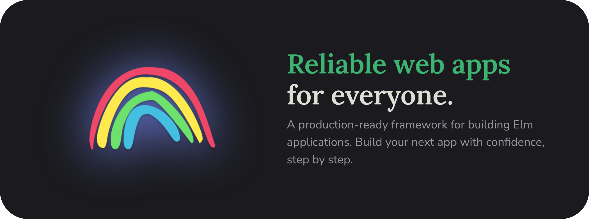

[](https://elm.land)

# Elm Land

[](https://github.com/elm-land/elm-land/actions/workflows/cli.js.yml)
[](https://github.com/elm-land/elm-land/actions/workflows/graphql.js.yml)

[](https://npmjs.com/package/elm-land)
[](https://github.com/elm-land/elm-land)
[](https://join.elm.land) 
[](https://twitter.com/elmland_)


## Introduction

Welcome to [Elm Land](https://elm.land), an application framework that helps you build reliable web applications using the [Elm](https://elm-lang.org) programming language. 

Inspired by projects like [Nuxt](https://nuxt.com), [Next.js](https://nextjs.org), and [Ruby on Rails](https://rubyonrails.org/), Elm Land's goal is make you feel productive _fast_– even if you're completely new to Elm.

We take care of the developer tooling, conventions, and provide learning resources so you can focus on building your next app with confidence.

## Quickstart

> __Required:__ [Node.js 18.x](https://nodejs.org) or higher

### 🌱 Create a new project

```bash
$ npx elm-land new my-cool-app
```

### 📂 Explore the folder structure

```sh
my-cool-app/
|- elm.json
|- elm-land.json
|- src/
   |- Pages/
      |- Home_.elm
```

### 🚀 Run it in the browser

```bash
$ npx elm-land server
```

### 📦 Build it for production

```bash
$ npx elm-land build
```

__Ready to learn more?__ Visit https://elm.land/guide for in-depth guides and practical examples.

---

## Exploring this repository

Elm Land is open source and free to use. The code for this GitHub project is broken down into smaller projects within one "monorepo".

### __[@elm-land/cli](./projects/cli/)__

The official CLI tool, available at [npmjs.org/elm-land](https://npmjs.org/elm-land). This includes `elm-land new`, `elm-land server`, and the other commands you'll run from a terminal.

### __[@elm-land/www](./docs/)__

The documentation website including guides, concepts, and real-world examples. Available at [elm.land](https://elm.land).

### __[@elm-land/graphql](./projects/graphql/)__ 

Write GraphQL code and we'll generate the Elm code for you! (Available via [npm](https://npmjs.org/@elm-land/graphql))

### __[@elm-land/css](./projects/css)__

Generate a type-safe Elm code from a standard CSS file. Works great with existing CSS frameworks, too! (Available via [npm](https://npmjs.org/@elm-land/css))

### __[@elm-land/codegen](./projects/codegen/)__ 

The codegen library used internally by Elm Land to generate Elm code. Feel free to steal it for your Elm tooling.
