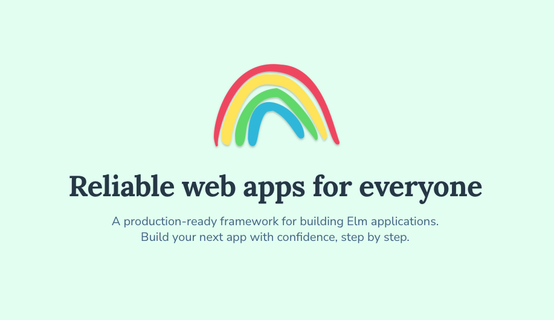

# Elm Land

This GitHub repo is made up of two projects:

- __[@elm-land/docs](./docs/)__ - The official website at [elm.land](https://elm.land)
- __[@elm-land/cli](./cli/)__ - The CLI tool available at [npmjs.org/elm-land](https://npmjs.org/elm-land)
