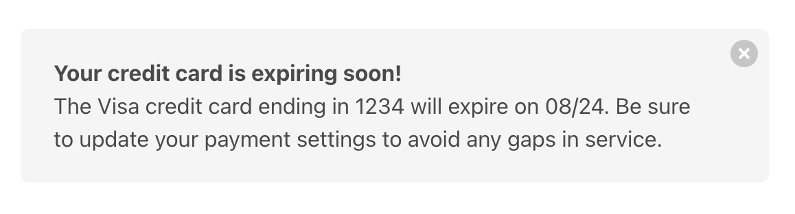
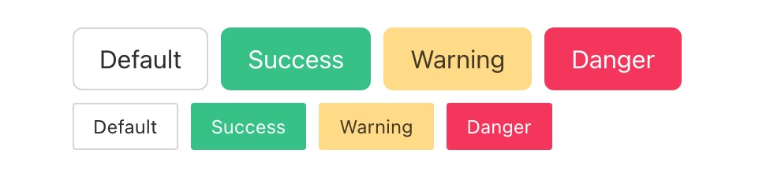
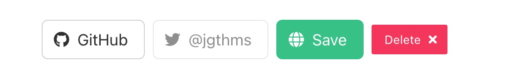
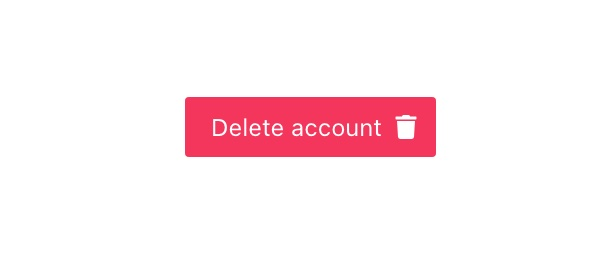

# Components

## Overview


In a JavaScript framework like React or Vue.js, UI components are created in their own `.jsx` or `.vue` files. In general, these components are able to:

1. Take in "props" as initial arguments.
2. Emit events back to their parents.
3. Store their own internal state.
4. Define how they should render on the page.

The core design of Elm prevents us from sending API requests or other fancy stuff from our `view` function. This section will show you how to do all the same great stuff with `.elm` files.

Let's start by learning about the three kinds of components in Elm projects.

## The "123s" of Elm components

After exploring many different techniques for building Elm components, we've found a simple system that works great! We'll be referring to this system as "the 123s of Elm components", because of the three step system.

Each step will build on the last, so we'll learn them in order:

1. [Simple view functions](#_1-simple-view-functions)
1. [Configurable components](#_2-configurable-components)
1. [Stateful components](#_3-stateful-components)


## 1. Simple view functions

Let's start with the most simple kind of component in Elm: a `view` function! A view function can take in some values, and return some HTML. No side effects, no internal state– just a function.

Let's imagine we need to create a "Notification" component, based off the one we see in the official Bulma guide. This component looks something like this:




### Defining the component

Let's create a new file in `src/Components/Notification.elm`:

```elm
module Components.Notification exposing (view)

import Html exposing (..)
import Html.Attributes exposing (class)
import Html.Events exposing (onClick)


view :
    { title : String
    , description : String
    , onDismiss : msg
    }
    -> Html msg
view props =
    div [ class "notification" ]
        [ button [ class "delete", onClick props.onDismiss ] []
        , div []
            [ p [] [ strong [] [ text props.title ] ]
            , p [] [ text props.description ]
            ] 
        ]
```

Our `Components.Notification.view` function takes in a value called `props` with three fields:

1. `title` – The string to render in bolded text
1. `description` – Another string to render below the title
1. `onDismiss` – The `Msg` provided by the caller, that we should send when the "X" button is clicked!

It uses those three values to return some HTML that can be rendered by another page, layout, or component. 

The important thing to note is that the `props` passed into a simple function can contain __values to render__ like `String`, but also __messages to emit__ when an event (like `onClick`) comes in. 

Having the flexible, lowercase `msg` means we can use this component on _any_ page, as we'll see in the next section!

#### What about the CSS?

To keep the focus on how to structure your Elm components, we'll be using Bulma CSS, which provides classes we can use in our Elm files. To use Bulma in our Elm Land project, we can update our `elm-land.json` file to include the `<link>` tag:


```json { 10-12 }
{
  "app": {
    "elm": {
      "development": { "debugger": true },
      "production": { "debugger": false }
    },
    "env": [],
    "html": {
      // ...
      "link": [
        { "rel": "stylesheet", "href": "https://cdn.jsdelivr.net/npm/bulma@0.9.4/css/bulma.min.css" }
      ],
      // ...
    }
  }
}
```


### Using the component

Now that we have a `Components.Notification` component, we can use it anywhere we like! If we decide to use it on the homepage, we'll need to:

1. Import the `Components.Notification` module
2. Call the `Components.Notification.view` function

```elm
import Components.Notification

viewCreditCardNotification : Html Msg
viewCreditCardNotification =
    Components.Notification.view
        { title = "Your credit card expires soon!"
        , description = "The Visa credit card ending in [...] gaps in service."
        , onDismiss = DismissedNotification
        }
```

::: details "What HTML would get rendered in my browser?"

When you pass this data into your `Components.Notification.view` function, those
props would get mixed in with the other HTML to create this:

```html
<div class="notification">
  <button class="delete"></button>
  <div>
    <p><strong>Your credit card expires soon!</strong></p>
    <p>
      The Visa credit card ending in 1234 will expire on 08/24.
      Be sure to update your payment settings to avoid any
      gaps in service.
    </p>
  </div>
</div>
```

:::


## 2. Configurable components

Using a simple view function is always recommended, because of how easy they are to drop-in to your application. But what if you have a component that has a lot of variants? What if you have something like a "Button" component that can come in one of many styles?




With all the combinations of styles, sizes, disabled states, and more, using the simple `view` function approach can be a time-consuming process:

```elm
-- ❌ BEFORE: The tedious way, that we don't recommend!
viewCreatePostButton : Html Msg
viewCreatePostButton =
    Components.Button.view
        { label = "Create post"
        , onClick = ClickedCreatePost
        , style = Components.Button.Style.Default
        , size = Components.Button.Size.Normal
        , iconLeft = Nothing
        , iconRight = Nothing
        , isDisabled = False
        }
```

When everything needs to be provided, it can also be hard to tell what the right defaults are for a button. Lucky for us, there's an easier way: __the "Settings Pattern"!__ 


```elm
-- ✅ AFTER: The "Settings" pattern
viewCreatePostButton : Html Msg
viewCreatePostButton =
    Components.Button.new
        { label = "Create post"
        , onClick = ClickedCreatePost
        }
        |> Components.Button.view
```

This section of the guide will show you how to create components that only ask for __required props__, and allow you to use [Elm's "pipeline operator"](https://package.elm-lang.org/packages/elm/core/latest/Basics#(|%3E)) to __optionally pass in additional settings__.

### Defining the component

The big idea behind this design is to:

1. Define an "opaque" `Button` type ("opaque" means it won't expose its internal value)
2. Expose a `new` function, which turns required props into a `Button`
3. Expose a few "modifier" functions to provide any optional features
4. Expose a `view` function that converts the `Button` type into HTML for rendering

To see a visual example of how this works, let's look at an implementation of `Components.Button` that follows this pattern:

```elm
module Components.Button exposing
    ( Button, new
    , view
    , withStyleSuccess, withStyleWarning, withStyleDanger
    , withSizeSmall
    , withIconLeft, withIconRight
    , withIsDisabled
    )

{-|

## Basic usage

@docs Button, new
@docs view

## Modifiers

@docs withStyleSuccess, withStyleWarning, withStyleDanger
@docs withSizeSmall
@docs withIconLeft, withIconRight
@docs withDisabled

-}
import Components.Icon exposing (Icon)
import Html exposing (..)
import Html.Attributes exposing (..)
import Html.Events


-- SETTINGS


type Button msg
    = Settings
        { label : String
        , onClick : msg
        , style : Style
        , size : Size
        , iconLeft : Maybe Icon
        , iconRight : Maybe Icon
        , isDisabled : Bool
        }


new : { label : String, onClick : msg } -> Button msg
new props =
    Settings
        { label = props.label
        , onClick = props.onClick
        , style = Default
        , size = Normal
        , iconLeft = Nothing
        , iconRight = Nothing
        , isOutlined = False
        , isDisabled = False
        }


-- MODIFIERS


type Style
    = Default
    | Success
    | Warning
    | Danger


withStyleSuccess : Button msg -> Button msg
withStyleSuccess (Settings settings) =
    Settings { settings | style = Success }


withStyleWarning : Button msg -> Button msg
withStyleWarning (Settings settings) =
    Settings { settings | style = Warning }


withStyleDanger : Button msg -> Button msg
withStyleDanger (Settings settings) =
    Settings { settings | style = Danger }


type Size
    = Normal
    | Small


withSizeSmall : Button msg -> Button msg
withSizeSmall (Settings settings) =
    Settings { settings | size = Small }


withIconLeft : Icon -> Button msg -> Button msg
withIconLeft icon (Settings settings) =
    Settings { settings | iconLeft = Just icon }


withIconRight : Icon -> Button msg -> Button msg
withIconRight icon (Settings settings) =
    Settings { settings | iconRight = Just icon }


withDisabled : Bool -> Button msg -> Button msg
withDisabled isDisabled (Settings settings) =
    Settings { settings | isDisabled = isDisabled }


-- VIEW


view : Button msg -> Html msg
view (Settings settings) =
    let
        viewOptionalIcon : Maybe Icon -> Html msg
        viewOptionalIcon maybeIcon =
            case maybeIcon of
                Just icon ->
                    Components.Icon.view icon

                Nothing ->
                    text ""
    in
    button
        [ Html.Events.onClick settings.onClick
        , class "button"
        , classList
            [ ( "is-success", settings.style == Success )
            , ( "is-warning", settings.style == Warning )
            , ( "is-danger", settings.style == Danger )
            , ( "is-small", settings.size == Small )
            ]
        , disabled settings.isDisabled
        ]
        [ viewOptionalIcon settings.iconLeft
        , text settings.label
        , viewOptionalIcon settings.iconRight
        ]

```

### Using the component

Now that we have this new `Components.Button` module, we can easily create standard buttons with only the `new` and `view` functions:

```elm
viewSignUpButton : Html msg
viewSignUpButton =
    Components.Button.new
        { label = "Sign up"
        , onClick = ClickedSignUp
        }
        |> Components.Button.view
```


We can also customize our button by using our "modifier" functions with Elm's pipeline operator:

```elm
viewSignUpButton : Html msg
viewSignUpButton =
    Components.Button.new
        { label = "Delete account"
        , onClick = ClickedDeleteAccount
        }
        |> Components.Button.withStyleDanger
        |> Components.Button.withSizeSmall
        |> Components.Button.withIconRight Components.Icon.trash
        |> Components.Button.view
```




::: tip Extra resources

I first learned about this component design idea from Brian Hicks, in his talk ["Robot Buttons from Mars"](https://www.youtube.com/watch?v=PDyWP-0H4Zo). That talk introduces the benefits of the appraoch, and how it compares to similar alternatives.

This is the recommended way to define configurable stuff in Elm Land! :rainbow:

:::

## 3. Stateful components

Alright, here comes the powerful stuff! The two patterns we showed above are fundamental to this last one, so after reading this you should be able to make _any_ kind of component in Elm! But what is a "stateful component", and when should you use it?

In frameworks like React or Vue, all components are able to:

1. __Accept "props"__ to pass in initial state or other configuration
2. __Track private "state"__ that doesn't need to be managed by the parent
3. __Perform "side-effects"__ like HTTP calls, saving things to local storage
4. __"Emit" events__ back up to the parent, notifying it when something changes

In the examples above, we had simple UI components that didn't need all that stuff. For that reason, we took advantage of that fact to make them easy to embed in any page, layout, or parent component's `view` function.

### Defining the component

Sometimes, our applications will have a need for a more complex component like a __dropdown__ that needs to:

1. Track which item is currently selected
1. Track whether the results menu is open or closed
1. Track a search input value for quick-filtering
1. Emit important events to the parent like `onChange`

When we want a component to track its own state, its time to follow ["The Elm Architecture"](https://guide.elm-lang.org/architecture) and unlock some of the hidden benefits of using Elm Land's `Effect` type. 

#### Outlining the component's API

Let's start by outlining our component's API with types. We'll fill in all the real implementation details together in the section after this one.

Here's what we'll need for `src/Components/Dropdown.elm`:

```elm
module Components.Dropdown exposing
    ( Dropdown, new
    , Model, init
    , Msg, update
    , view
    , withSizeSmall, withDisabled
    , withOnChange
    )

{-|

## Basic usage

@docs Dropdown, new
@docs Model, init
@docs Msg, update
@docs view

## Modifiers

@docs withSizeSmall, withDisabled
@docs withOnChange

-}


-- SETTINGS


type Dropdown item msg
    = ...


new :
    { model : Model item
    , toMsg : Msg item msg -> msg
    , choices : List item
    , toLabel : item -> String
    }
    -> Dropdown item msg
new props =
    ...


--- MODIFIERS


withSizeSmall : Dropdown item msg -> Dropdown item msg
withSizeSmall =
    ...


withDisabled : Dropdown item msg -> Dropdown item msg
withDisabled =
    ...


withOnChange :
    (Maybe item -> msg)
    -> Dropdown item msg
    -> Dropdown item msg
withOnChange =
    ...


-- MODEL


type Model item
    = ...


init : { selected : Maybe item } -> Model item
init =
    ...


-- UPDATE


type Msg item msg
    = ...


update :
    { msg : Msg item msg
    , model : Model item
    , toModel : Model item -> model
    , toMsg : Msg item msg -> msg
    }
    -> ( model, Effect msg )
update =
    ...


-- VIEW


view : Dropdown item msg -> Html msg
view =
    ...
```

Just like before, we'll use [the "Configurable Component" pattern](#_2-configurable-components) to make supporting optional arguments easy. But this time around, our required arguments for `new` will include the internal `model` of our dropdown and a way to convert its internal `Msg` type to the `msg` type of the parent.

Let's walk through the implementation of each section:

### Part 1: Defining the settings

Just like we saw in the previous section, we start by creating an opaque `Dropdown` type. Because the `Settings` variant is not exposed, we know that only `Components.Dropdown` knows about the internal fields here.

Additionally, the `new` function is the __only way__ to create a `Dropdown` value. This function only asks for the required arguments, and fills in default values for the rest:

```elm
-- SETTINGS


type Dropdown item msg
    = Settings
        { model : Model item
        , toMsg : Msg item msg -> msg
        , choices : List item
        , toLabel : item -> String
        , size : Size
        , isDisabled : Bool
        , onChange : Maybe (item -> msg)
        }
        


new :
    { model : Model item
    , toMsg : Msg item msg -> msg
    , choices : List item
    , toLabel : item -> String
    }
    -> Dropdown item msg
new props =
    Settings
        { model = props.model
        , toMsg = props.toMsg
        , choices = props.choices
        , toLabel = props.toLabel
        , size = Normal
        , isDisabled = False
        , onChange = Nothing
        }
```

The only part that should look new is the `item` variable in our `Dropdown` type. For this specific component, we want to be able to select `Int`, `String`, or any other custom data types in our dropdown like `Person` or `BlogPost`.

By using the lowercase, generic `item` type, this choices in this dropdown can be a `List` of anything. This adds some noise to the `Dropdown` type, but this pattern would work for a simpler `Dropdown msg` too.

### Part 2: Defining the modifiers

These modifier functions allow the caller to customize the internal settings, without needing to leak all the implementation details. Here, we'll see that we can also use this pattern to provide optional event listeners like `onChange`.

We'll call this later in our `update` function when the dropdown value changes!

```elm
--- MODIFIERS


type Size
    = Normal
    | Small


withSizeSmall : Dropdown item msg -> Dropdown item msg
withSizeSmall (Settings settings) =
    Settings { settings | size = Small }


withDisabled : Dropdown item msg -> Dropdown item msg
withDisabled (Settings settings) =
    Settings { settings | isDisabled = True }


withOnChange :
    (item -> msg)
    -> Dropdown item msg
    -> Dropdown item msg
withOnChange onChange (Settings settings) =
    Settings { settings | onChange = Just onChange }

```

### Part 3: Defining `Model` and `init`

We'll use the same "opaque type" trick from `Dropdown` to make sure that the internals of our dropdown's `Model` aren't leaked to the parent. This is totally optional, and will involve a bit more work internally, but can help make refactoring easier down the line.

Because the `Model` is opaque, we'll also need a way to initialize it. We'll use the familiar name `init` that we see in other Elm programs. This is also the same function you'll see used by pages and layouts in the other Elm Land guides:

```elm
-- MODEL


type Model item
    = Model
        { selected : Maybe item
        , search : String
        , isMenuOpen : Bool
        }


init : { selected : Maybe item } -> Model item
init props =
    Model
        { selected = props.selected
        , search = ""
        , isMenuOpen = False
        }

```

For our `init` function, we want new dropdowns to always have their menus closed and the search query set to an empty string. If we decided that those were useful for the parent to initialize, we would add them to our `props`.

For now, just letting the caller specify an initial selected value seems like a good idea. This will make our `dropdown` useful in contexts where we receive a selected value from our API server.

### Part 4: Defining `Msg` and `update`

We'll want our dropdown component to be able to internally handle events triggered by user interactions. For example, when the user clicks the dropdown, we want to open the menu and reveal the possible choices. Clicking outside the menu, or selecting an option should dismiss the menu. When a value changes, we'll also want to emit the `onChange` event.

Here's our definition of `Msg` and `update` to support all that important stuff:

```elm
-- UPDATE


type Msg item msg
    = FocusedDropdown
    | BlurredDropdown
    | UpdatedSearchInput String
    | SelectedItem
        { item : item
        , onChange : Maybe msg
        }


update :
    { msg : Msg item msg
    , model : Model item
    , toModel : Model item -> model
    , toMsg : Msg item msg -> msg
    }
    -> ( model, Effect msg )
update props =
    let
        (Model model) =
            props.model

        toParentModel : ( Model item, Effect msg ) -> ( model, Effect msg )
        toParentModel ( innerModel, effect ) =
            ( props.toModel innerModel
            , effect
            )
    in
    toParentModel <|
        case props.msg of
            FocusedDropdown ->
                ( Model { model | isMenuOpen = True }
                , Effect.none
                )

            BlurredDropdown ->
                ( Model { model | search = "", isMenuOpen = False }
                , Effect.none
                )

            UpdatedSearchInput value ->
                ( Model { model | search = value }
                , Effect.none
                )

            SelectedItem data ->
                ( Model 
                    { model
                        | search = ""
                        , isMenuOpen = False
                        , selected = Just data.item
                    }
                , case data.onChange of
                    Just onChange ->
                        Effect.sendMsg onChange
                    
                    Nothing ->
                        Effect.none
                )
```

In the `update` function, we defined `(Model model)` and `toParentModel` to make implementing each branch of logic easier. Once we have access to an unwrapped `model` value, we can use Elm's record update syntax.

We also pipe all the output of our `case` expression into `toParentModel` so that we actually return `( model, Effect msg )` as promised. This is made possible by the `props.toModel` function provided to us by the caller.

::: details "Wait, what about `props.toMsg`?"

In this specific example, we didn't send internal `Msg` values from `update`. For that reason, you may have noticed the `props.toMsg` value wasn't used.

This value is still very useful if this dropdown:
1. Needed to send HTTP requests to fetch choices based on the search
1. Used keyboard navigation, with [`Browser.Dom.focus`](https://package.elm-lang.org/packages/elm/browser/1.0.2/Browser-Dom#focus), to select dropdown items as the user presses up/down arrow keys.

Those advanced scenarios were omitted to keep the example above focused. Regardless, here's how you _would_ use `props.toMsg` if the component you're making needs to perform it's own internal commands or effects:

```elm{8,16}
update props =
    -- ...
    PressedKeyUp idOfPreviousMenuItem ->
        ( model
        , Browser.Dom.focus idOfPreviousMenuItem
            |> Task.attempt FocusedMenuItem
            |> Effect.sendCmd
            |> Effect.map props.toMsg
        )

    PressedKeyDown idOfNextMenuItem ->
        ( model
        , Browser.Dom.focus idOfNextMenuItem
            |> Task.attempt FocusedMenuItem
            |> Effect.sendCmd
            |> Effect.map props.toMsg
        )

    FocusedMenuItem result ->
        ( model, Effect.none )
```

Without the `props.toMsg`, this page would return `( model, Effect (Msg item msg) )` instead of the nice `( model, Effect msg )` promised by our type annotation.

:::

### Part 5. Defining the view

Now it's up to our `view` to look at the dropdown's settings to determine what to render, and which events to emit as the user interacts with our component. 

This is mostly just the stuff we saw before, but note how we use `props.toMsg` to make sure we're returning `Html msg` instead of `Html (Msg item msg)`.

This is an important part of making this component easier to plug in!

```elm
-- VIEW


view : Dropdown item msg -> Html msg
view (Setting settings) =
    let
        (Model model) =
            settings.model

        onSearchInput : String -> msg
        onSearchInput value =
            props.toMsg (UpdatedSearchInput value)

        -- View the input of the dropdown, that opens the 
        -- menu when focused, and displays the search query
        viewDropdownInput : Html msg
        viewDropdownInput =
            div [ style "dropdown__toggle" ]
                [ input
                    [ class "dropdown__input"
                    , type_ "search"
                    , disabled settings.isDisabled
                    , onInput onSearchInput
                    , onFocus (props.toMsg FocusedDropdown)
                    , onBlur (props.toMsg BlurredDropdown)
                    ]
                    []
                , viewSelectedValueOverlay
                ]

        -- If a value is selected, this overlay should
        -- appear over our input field when the menu is closed
        viewSelectedValueOverlay : Html msg
        viewSelectedValueOverlay = 
            case model.selected of
                Nothing ->
                    text ""

                Just item ->
                    if model.isMenuOpen then
                        text ""

                    else
                        strong
                            [ class "dropdown__selected" ]
                            [ text (settings.toLabel item) ]


        viewDropdownMenu : Html msg
        viewDropdownMenu =
            if model.isMenuOpen then
                div [ class "dropdown__menu" ]
                    (List.map viewDropdownMenuItem settings.choices)

            else
                text ""

        viewDropdownMenuItem : item -> Html msg
        viewDropdownMenuItem item =
            button
                [ class "dropdown__menu-item"
                , onClick onMenuItemClick
                ]
                [ text (settings.toLabel item)
                ]

        onMenuItemClick : item -> msg
        onMenuItemClick item =
            props.toMsg  <|
                case settings.onChange of
                    Just onChange ->
                        SelectedItem
                            { item = item
                            , onChange = Just (onChange item)
                            }
                    
                    Nothing ->
                        SelectedItem
                            { item = item
                            , onChange = Nothing
                            }

    in
    div [ class "dropdown"
        , classList
            [ ( "dropdown--small", settings.size == Small )
            ]
        ]
        [ viewDropdownInput
        , viewDropdownMenu
        ]
```

### Using the component

Now that we're done defining it, let's take a quick look at how we would use it on a page like `Pages.Home_`. Because this component involved a `Model`, `Msg`, and `view`, we'll need to add each part in the matching location on our page.

Let's imagine  our homepage needs a dropdown to allow users to select the animal that will become the next president of the United States. For convenience, we've defined the available animals in an `Animal` module, which has its own `toName` function.

```elm{12,18,29,36-42,57-64}
module Pages.Home_ exposing (Model, Msg, page)

import Animal exposing (Animal)
import Components.Dropdown

-- ... other imports and `page` function


-- MODEL

type alias Model =
    { dropdown : Components.Dropdown.Model Animal
    }


init : () -> ( Model, Effect Msg )
init _ =
    ( { dropdown = Components.Dropdown.init { selected = Nothing }
      }
    , Effect.none
    )


-- UPDATE


type Msg
    = DropdownSent (Components.Dropdown.Msg Animal Msg)
    | ChangedSelection Animal


update : Msg -> Model -> ( Model, Effect Msg )
update msg model =
    case msg of
        DropdownSent innerMsg ->
            Components.Dropdown.update
                { msg = innerMsg
                , model = model.dropdown
                , toModel = \dropdown -> { model | dropdown = dropdown }
                , toMsg = DropdownSent
                }

        ChangedSelection animal ->
            ( model, Effect.none )


-- VIEW


view : Model -> View Msg
view model =
    { title = "Homepage"
    , body =
        [ h1 [] [ text "Select a president:" ]
        , Components.Dropdown.new
            { model = model.dropdown
            , toMsg = DropdownSent
            , choices = Animal.list
            , toLabel = Animal.toName
            }
            |> Components.Dropdown.withOnChange ChangedSelection
            |> Components.Dropdown.view
        ]
    }
    
```


::: details Here's that example `Animal` module

```elm
module Animal exposing (Animal, list, toName)


type Animal
    = Dog
    | Cat
    | Dolphin
    | Pig


list : List Animal 
list =
    [ Dog, Cat, Dolphin, Pig ]


toName : Animal -> String
toName animal =
    case animal of
        Dog ->
            "🐶 Mr. Doge"

        Cat ->
            "🐱 Ms. Kitten"

        Dolphin ->
            "🐬 Dr. Dolphin"

        Pig ->
            "🐷 Lt. Piggins"
```

:::

As you can see, each part of our `init/update/view` can plug in to our new dropdown component. The important design decision we made was to handle all the `toModel` and `toMsg` logic __within the component__.

Components are designed to be written once and used in multiple places, so try to optimize for the folks using your UI. It definitely meant more typing up front in the [Defining the component](#defining-the-component-2) section, but hopefully that made our module easier for us and our teammates to use across our application.

#### You made it!

Nice work, that guide was a long one! I hope these patterns help you scale your Elm Land applications, and provide a nice foundation for designs that work for you and your team. 

I hope to see you in the next guide, where we explain the `Shared` modules and how they can help you share data across your pages!
