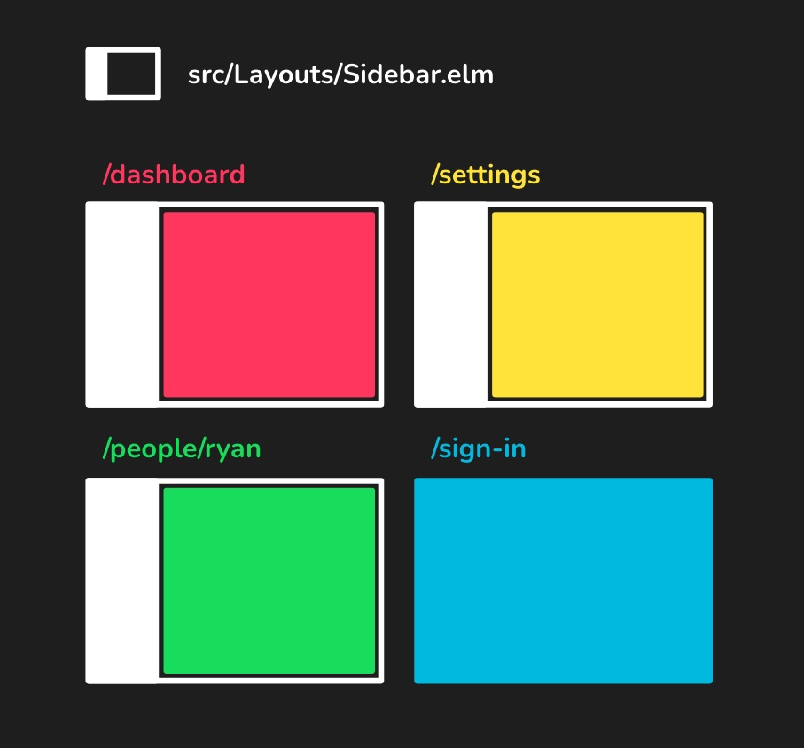
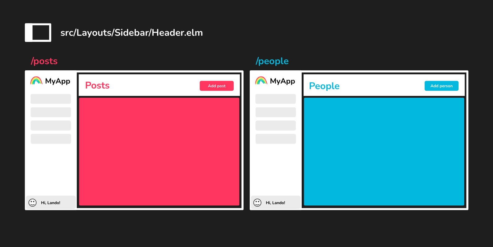

# Layouts

## Overview

Layouts allow your pages to reuse stateful UI. They can save you time wiring things up, and prevent bugs that come from duplication across pages. In many web apps, you might have a common element, like a sidebar, that should available across those pages.

In Elm Land, each page explicitly chooses the layout it wants to use. This design choice means there aren't be any secret or "default" layouts. For example, if you have a sign-in page that you don't want to use your sidebar layout, that's totally fine!



In this guide, we'll learn how to create and use layouts. 

::: tip Have you read about pages, yet?

If you haven't read [the previous "Pages" section](./pages.md), we recommend you check that out first. Layouts won't make much sense until you know the basics of how pages work!

:::

## Adding layouts

To add a new layout, you can use the `elm-land` CLI tool:

```sh
elm-land add layout Sidebar
```

This generates a new file at `src/Layouts/Sidebar.elm`, which looks like this:

```elm
module Layouts.Sidebar exposing (Settings, Model, Msg, layout)

import Layout exposing (Layout)
-- ...


type alias Settings =
    {}


layout : 
    Settings
    -> Shared.Model
    -> Route ()
    -> Layout () Model Msg contentMsg
layout settings shared route =
    Layout.new
        { init = init
        , update = update
        , view = view
        , subscriptions = subscriptions
        }

-- ...

```

This file should look somewhat familiar to you after reading [the Pages guide](./pages.md). Let's compare the two functions side-by-side to understand what's changed:

```elm
-- PAGES
page : Shared.Model -> Route () -> Page Model Msg

-- LAYOUTS
layout : Settings -> Shared.Model -> Route () -> Layout () Model Msg contentMsg
```

Although some things are the same, there are two new types we haven't seen before:

1. `Settings` 
1. `Layout () Model Msg contentMsg`


#### `Settings`

As we'll see in the ["Using layouts" section](#using-layouts) below, it's common for pages to send data or other information to their layout. In Elm Land, the `Settings` type defined in your layout file determines what information can be sent by a page.

For our new sidebar layout, let's say our we always expect an `Auth.User` value. This way, we won't have to worry about what the sidebar looks like when a user is not signed in:

```elm{3,7-9}
module Layouts.Sidebar exposing (Settings, Model, Msg, layout)

import Auth
import Layout exposing (Layout)
-- ...

type alias Settings =
    { user : Auth.User
    }


layout : Settings -> Shared.Model -> Route () -> Layout () Model Msg contentMsg
layout settings shared route =
    ...


-- ...
```

::: tip "Whats an `Auth.User`?"

Elm Land comes with a system for making user authentication really easy!

We briefly covered this in the "User authentication" section in the Pages guide. Later on, in the `Auth` section, we'll learn more about how
the `User` value works.

( For now, here's all you need to know: If any page or layout has access to an `Auth.User` value, that view will only be visible for signed-in users. )

:::

#### `Layout () Model Msg contentMsg`

Our `layout` function returns a `Layout` type. This `Layout` type bundles up all the settings for how to render a layout.

There are four parameters on the `Layout` type:

1. `()` – This is a placeholder for "parent settings" which, we'll cover in the [Nested layouts](#nested-layouts) section below.
1. `Model` – This means our `Layout` will store a `Model` to track it's local state
1. `Msg` – Says our `Layout` will send these `Msg` values when user events occur.
1. `contentMsg` – This last parameter allows the layout's `view` function to embed the page's HTML anywhere in our layout.


### Understanding layouts

Layouts are very similar to pages, and even have identical `init/update/subscriptions` functions.

But here's what makes the layout's `view` function is unique:
1. It allows you to __embed__ other page or layout HTML anywhwere you like.
1. It supports __nesting__ layouts to save you time and prevent bugs.

Here is a closer look at the four functions used in every layout:

#### `init`

This function is called anytime your layout loads.

```elm
init : () -> ( Model, Effect Msg )
init _ =
    ...
```

#### `update`

This function is called whenever a user or the browser sends a message.

```elm
update : Msg -> Model -> ( Model, Effect Msg )
update msg model =
    ...
```

#### `view`

This `view` function converts the current model to the HTML you want to show the user. 

```elm
view :
    { model : Model
    , toContentMsg : Msg -> contentMsg
    , content : View contentMsg
    }
    -> View contentMsg
view { model, toContentMsg, content } =
    ...
```


::: details "Wait, what's up with 'content' and 'toContentMsg'?"

Unlike a page's view function, layouts also have access to a `content` argument. The `content` value allows you to embed the inner page (or nested layout) anywhere you like within your layout.

To allow you to mix this layout's `Html Msg` with the inner content's `Html contentMsg`, you'll have access to the `toContentMsg` function. This is commonly used with
`Html.map` to make sure that a single `Html contentMsg` value is returned by the `view` function.

Here's an example of how you would use these two values in a real layout:

```elm{8,12,14,18}
view :
    { model : Model
    , toContentMsg : Msg -> contentMsg
    , content : View contentMsg
    }
    -> View contentMsg
view { model, toContentMsg, content } =
    { title = content.title ++ " | My app" 
    , body =
        [ -- View the sidebar
          viewSidebar model
            |> Html.map toContentMsg
          -- View the inner content  
        , div [ class "page" ] content.body
        ]
    }

viewSidebar : Model -> Html Msg
viewSidebar model =
    aside [ class "sidebar" ] [ ... ]
```

Here are some highlights from the code snippet above:

1. __On line 8__, we appended `" | My app"` to the end of whatever `title` came in from the content in this layout.
    - Let's imagine that our `Page.Settings` file is using this sidebar layout.
    - If the `Page.Settings.view` function returned the title `"Settings"`, we would see `"Settings | My app"` as the tab title displayed for this page. 
1. __On line 12__, we used the `toContentMsg` function along with to `Html.map`. This converts the `Html Msg` value returned by `viewSidebar` into the expected `Html contentMsg` value our `view` function needs to return.
1. __On line 14__, we embedded the HTML content from our page into a `<div class="page">` tag.
    - If we were on the `Settings` page, then `content.body` would be the exact HTML content returned by the `Page.Settings.view` function.
1. __On line 16__, we use a capitalized `Msg` type in the HTML value we returned. This means our `viewSidebar` can send messages in this function, which is important for interactive layouts!
:::

#### `subscriptions`

This function listens for ongoing events like "window resized" or "javascript sent a message" and forwards that as a `Msg` for the `update` function to handle.

```elm
subscriptions : Model -> Sub Msg
subscriptions model =
    ...
```


## Removing layouts

Just like we saw with pages, there's no special command for removing layout files. To remove a layou, you can either delete the file in your file explorer, or from your terminal:

```sh
rm src/Layouts/Sidebar.elm
```

Elm Land will clean up the generated `Layouts.Sidebar` custom type variant, and the Elm compiler will let you know if any pages are impacted.


## Using layouts

Although most of our pages should have a sidebar, there are certain pages that shouldn't. One common example of this is the "Sign in" page. Elm Land allows each pages to opt-in to use a layout.

For that reason, there is no default layout, or other mechanism to hide which layout a page is using. You can use the `Page.withLayout` function, documented in the Pages section, to add a layout to a page:

```elm{4,16,19-26}
module Pages.People exposing (Model, Msg, page)

import Page exposing (Page)
import Layouts
-- ...


page : Auth.User -> Shared.Model -> Route () -> Page Model Msg
page user shared route =
    Page.new
        { init = init
        , update = update
        , view = view
        , subscriptions = subscriptions
        }
        |> Page.withLayout (toLayout user)


{-| Use the sidebar layout on this page -}
toLayout : Auth.User -> Model -> Layouts.Layout Msg
toLayout user model =
    Layouts.Sidebar
        { title = "Settings"
        }
```

Here are the important things to know when using a layout:

1. __On line 4__, we import a `Layouts` module. This module is updated anytime you add a new layout in `src/Layouts. It provides a "custom type" with all possible layouts in your application.
    - __Note:__ This is distinct from the `Layout` module, which is used for defining layouts
1. __On line 16__, we use the [Page.withLayout](./pages.md#pagewithlayout) function to tell Elm Land which layout we'd like our `Settings` page to use. 
    - __Note:__ Because it is within the `page` function, you'll be able to access values like `user` and pass them along to your `toLayout` function.
1. __On line 20__, we define a `toLayout` function. This function has access to the `Model`, in case the layout we should use is based on the state of our page.
    - It uses the `Layouts.Sidebar` variant from the `Layouts` module
    - It passes in the `Layouts.Sidebar.Settings` value, so our layout is provided the `settings` it expects

When we go to the `/settings` page, you'll see that Elm Land has embedded the `Page.Settings` page inside the `Layouts.Sidebar` layout. You can repeat this process with as many pages as you want.


## Nested layouts

When we created `Layouts.Sidebar`, we created a normal top-level layout file. Just like pages use a file-naming convention to determine URL routing, layouts use a file-naming convention to support nesting layouts within each other.

One example of a nested layout could be if you're trying to standardize pages that use a sidebar and a header. Rather than reimplementing the sidebar layout in a separate layout, Elm Land lets you create a `Layouts.Sidebar.Header` that's automatically embedded in your existing `Layouts.Sidebar` file:

```sh
elm-land add layout Sidebar.Header
```

This command will create a file at `src/Sidebar/Header.elm`. This new layout file will include a way to provide `Layouts.Sidebar.Settings` into the parent component:


```elm{4,18,26-28}
module Layouts.Sidebar.Header exposing (Settings, Model, Msg, layout)

import Layout exposing (Layout)
import Layouts.Sidebar
-- ...


type alias Settings =
    { title : String
    , user : Auth.User
    }


layout :
    Settings
    -> Shared.Model
    -> Route ()
    -> Layout Layouts.Sidebar.Settings Model Msg contentMsg
layout settings shared route =
    Layout.new
        { init = init
        , update = update
        , view = view
        , subscriptions = subscriptions
        }
        |> Layout.withParentSettings
            { user = settings.user
            }
```

Here are a few differences between a nested layout and the standard one we saw earlier in this guide:

- __On line 18,__ you'll see the first argument of your `Layout` type holds the parent settings.
    - In this case, our parent layout settings type is `Layouts.Sidebar.Settings`
- __On line 26,__ we need to pass those `Layouts.Sidebar.Settings` in. 
    - Because we are within the `layout` function, we have access to our own `settings`
    - This gives our sidebar layout access to the `user` value it expected.


#### Usage example

Now that we have a `Layouts.Sidebar.Header`, we can use it on a page. Using a nested layout on a page
works exactly like any other layout.

You'll be able to follow the same steps as shown earlier [in the "Using layouts" section](#using-layouts):


```elm{3,14,17-22}
module Pages.Settings exposing (Model, Msg, page)

import Layouts
-- ...

page : Auth.User -> Shared.Model -> Route () -> Page Model Msg
page user shared route =
    Page.new
        { init = init
        , update = update
        , view = view
        , subscriptions = subscriptions
        }
        |> Page.withLayout (toLayout user)


toLayout : Auth.User -> Model -> Layouts.Layout Msg
toLayout user model =
    Layouts.Sidebar_Header
        { title = "Settings"
        , user = user
        }
```

## The "Layout" module

Every layout file imports a `Layout` module. This module provides the `Layout` type and the `Layout.new`. This section documents all the functions exposed, and what they are used for.

### Layout

This type represents a layout, and contains four parameters. 

```elm
type Layout parentSettings model msg contentMsg
```

Here's a breakdown of each parameter:

1. `parentSettings` – When working with [Nested layouts](#nested-layouts), this parameter is the parent layout's settings. For top-level layouts that aren't nested, this value is always `()`.
2. `model` – Represents the state of the layout
3. `msg` – Represents the messages the layout can send
4. `contentMsg` – Because layouts can embed other HTML, this common variable allows us to combine that HTML together. We describe this in more detail in [the "Understanding layouts" section](#understanding-layouts) above!

### Layout.new

Create a new layout, providing functions to describe how to initialize, update, and view your page.

```elm
Layout.new :
    { init : () -> ( Model, Effect Msg )
    , update : Msg -> Model -> ( Model, Effect Msg )
    , view :
        { model : Model
        , toContentMsg : Msg -> contentMsg
        , content : View contentMsg
        }
        -> View contentMsg
    , subscriptions : Model -> Sub Msg
    }
    -> Layout () Model Msg contentMsg
```

### Layout.withParentSettings

This is required for [nested layouts](#nested-layouts), which are embedded within other parent layouts. Use this function to provide settings that are required by the parent layout.

#### Type definition

```elm
Layout.withParentSettings :
    parentSettings
    -> Layout () Model Msg contentMsg
    -> Layout parentSettings Model Msg contentMsg
```

#### Usage example

```elm{12-14}
module Layouts.Sidebar.Header exposing (..)

-- ...

layout :
    Settings
    -> Shared.Model
    -> Route ()
    -> Layout Layouts.Sidebar.Settings Model Msg contentMsg
layout settings shared route =
    Layout.new { ... }
        |> Layout.withParentSettings
            { user = settings.user 
            }
```


### `Layout.withOnUrlChanged`

The `Layout.withOnUrlChanged` function allows a layout to respond to any changes in the URL __that don't involve navigating to another layout__.

For example, let's imagine we have the following 3 pages in our application:

Page | Layout
:-- | :--
`Pages.Dashboard` | `Layouts.Sidebar`
`Pages.Settings` | `Layouts.Sidebar`
`Pages.SignIn` | _None_

If we navigated from `/dashboard` to `/settings`, then our `UrlChanged` message would be sent to our `Layouts.Sidebar` module. 

If we navigated from `/dashboard` to `/dashboard?code=123`, we would also receive a message. However, if we navigated to the `/sign-in` route, we would __not receive__ a message, because the "Sign in" page doesn't use this layout.

Use the `Layout.withOnUrlChanged` whenever you want to know if the current page, query parameters, or hash has changed within a layout.


#### Type definition

```elm
Layout.withOnUrlChanged :
    ({ before : Route (), after : Route () } -> Msg)
    -> Layout () Model Msg
    -> Layout () Model Msg
```

#### Usage example

```elm{15,23,29-30}
module Layouts.Sidebar exposing (Settings, Model, Msg, layout)

import Layout exposing (Layout)
-- ...


layout : Settings -> Shared.Model -> Route () -> Layout () Model Msg
layout settings shared route =
    Layout.new
        { init = init
        , update = update
        , view = view
        , subscriptions = subscriptions
        }
        |> Layout.withOnUrlChanged UrlChanged


-- ...


type Msg
    = ...
    | UrlChanged { before : Route (), after : Route () }


update : Msg -> Model -> ( Model, Effect Msg )
update msg model =
    case msg of
        OnUrlChanged { before, after } ->
            ( model, Effect.none )

        ...
```

__Note:__ In [the Route section](./route), you'll learn about the `Route` type and how it stores URL information.


## Sending messages to pages

Earlier, we saw the `view` function allowed us to embed a page's HTML anywhere within a layout. In many web applications, you'll also want to embed page content in other places.



In the example above, we want to reuse all the layout and logic in our `Layouts.Sidebar.Header`, but we want to customize the button that appears in the top right corner of our header. Additionally, we want the individual page to handle the logic for "Add person" or "Add post".

### Upgrading our `Settings`

In order to accomplish this, we'll need to update our `Settings` type to support rending HTML with a `contentMsg` type variable:

```elm{7,9}
-- BEFORE
type alias Settings =
    { title : String
    }

-- AFTER
type alias Settings contentMsg =
    { title : String
    , button : Html contentMsg
    }
```

By adding this variable, we'll be able to embed that button anywhere we like in our layout's `view` function. 

### Usage example

Here's a quick example, because you're worth it!

__Updating the layout file__

```elm{3,10-13,16-20,24,32,42,53,55}
module Layouts.Sidebar.Header exposing
    ( Settings, Model, Msg, layout
    , map
    )

import Layout exposing (Layout)
-- ...


type alias Settings contentMsg =
    { title : String
    , button : Html contentMsg
    }


map : (msg1 -> msg2) -> Settings msg1 -> Settings msg2
map fn settings =
    { title = settings.title
    , button = Html.map fn settings.button
    }


layout :
    Settings contentMsg
    -> Shared.Model
    -> Route ()
    -> Layout Layouts.Sidebar.Settings Model Msg contentMsg
layout settings shared route =
    Layout.new
        { init = init
        , update = update
        , view = view settings
        , subscription = subscription
        }
        |> Layout.withParentSettings { user = settings.user }


-- ...


view :
    Settings contentMsg
    ->
        { model : Model
        , toContentMsg : Msg -> contentMsg
        , content : Html contentMsg
        }
    -> Html contentMsg
view settings { model, toContentMsg, content } =
    { title = content.title
    , body =
        [ header [ class "header" ]
            [ h1 [ class "title" ] [ text settings.title ]
            , div [ class "right-controls" ]
                [ settings.button
                ]
            ]
        , div [ class "content" ] content.body
        ]
    }
```

Here are some things to keep in mind:

- You can pass along `settings` value into your `view` function, just like we saw in the pages section (see line 22)
- Be sure to add the `contentMsg` parameter everywhere you see `Settings` in this file

::: tip What's up with that `map` function?

When you add the `contentMsg` variable to your `Settings` type, Elm Land will ask you to define
a `map` function to help convert your `Settings` type from one `contentMsg` to another.

This is essential for the generated code to connect this layout to the top-level application!

:::

__Using the layout on a page__

```elm{16,20-24}
module Pages.People exposing (Model, Msg, page)

import Layouts
-- ...

page : Auth.User -> Shared.Model -> Route () -> Page Model Msg
page user shared route =
    Page.new { ... }
        |> Page.withLayout (toLayout user)


toLayout : Auth.User -> Model -> Layouts.Layout Msg
toLayout user model =
    Layouts.Sidebar_Header
        { title = "People"
        , button = viewAddPersonButton model
        }


viewAddPersonButton : Model -> Html Msg
viewAddPersonButton model =
    button
        [ onClick ClickedAddPerson ]
        [ text "Add person" ]

-- ...

```

Under the hood, Elm Land will take care of converting your page's `Html Msg` into the `Html contentMsg` passed into your layout.

::: tip "Not just for HTML!" 

Upgrading your `Settings` to `Settings contentMsg` also opens up the possibility of sending messages from a layout to a page:

```elm{3}
type alias Settings contentMsg =
    { title : String
    , onPageResized : { width : Int, height: Int } -> contentMsg
    }
```

You can use this feature to respond to events from your layouts

:::