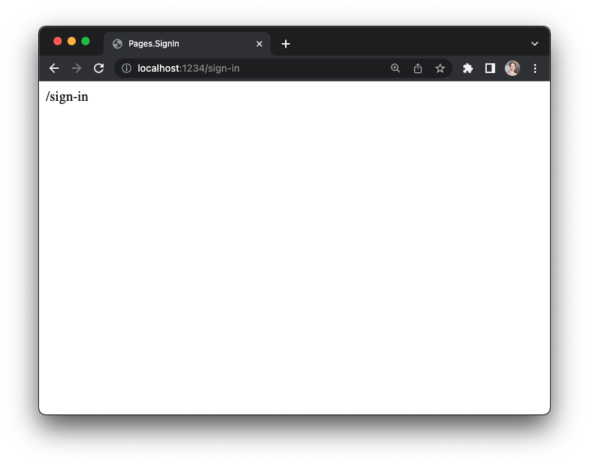
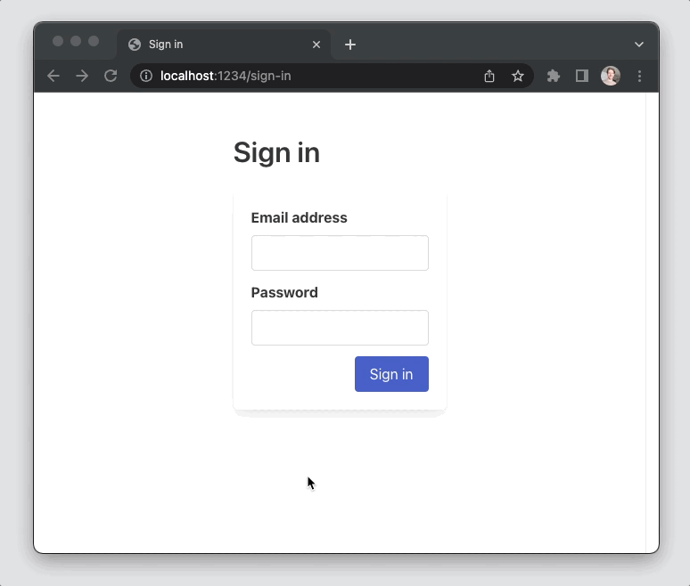
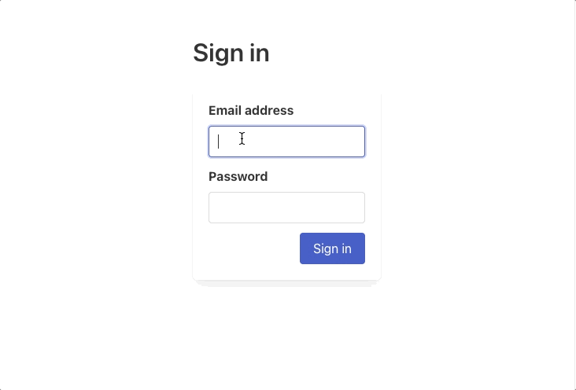
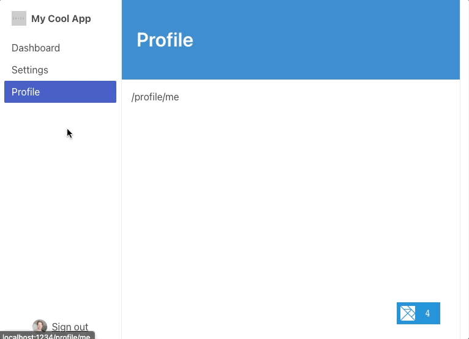

# User authentication

### What we'll learn

- How to __add a sign-in form__, with error handling
- How to __use local storage__ to save user tokens
- How to __automatically redirect to sign in__ pages
- How to __use layouts__ to reuse UI and logic across pages

<BrowserWindow src="/images/guide/user-auth.gif" alt="Demo of sign-in flow" />


Many applications require a signed-in user to render certain pages. For example, your app's `Dashboard` page should only be seen by folks who have already signed in. In contrast, these apps have other pages (like the `SignIn` page) that should be available even if folks are signed out.

This guide will walk you through how to build a complete sign-in process for a REST API that returns JSON web tokens (JWTs). Here are the things we'll make together:

1. Creating a sign-in page and adding a form
1. Handling sign-in form validation errors
1. Redirecting to another page after a successful login
1. Persisting user tokens with local storage, so they are still available after refresh
1. Handling redirects from any pages that require signed-in users

### Creating a new project

To get started, let's create a new Elm Land project using the CLI:

```sh
elm-land init user-auth
```

When that's ready, we can run the Elm Land server:

```sh
cd user-auth
```

```sh
elm-land server
```

Our new project should now be available at `http://localhost:1234`

## Creating a sign-in page

We can use the CLI to create a new page at `/sign-in`:

```sh
elm-land add page /sign-in
```

In the last few guides, we used `page:view`, `page:sandbox`, or `page:element` to create a page. This time, we'll be using the standard `elm add page` command. This will give us a fully featured page that will become useful for sharing our signed-in user across pages. We'll dive into how to do this soon!

Opening `http://localhost:1234/sign-in` in a web browser should show us a screen that looks like this:



## Adding a sign-in form

To make our sign-in form look nice, let's use a CSS framework called [Bulma](https://bulma.io). We can add the Bulma CSS by editing the `elm-land.json` file at the root of the project:


```json{6-8}
{
  "app": {
    "env": [],
    "html": {
      ...
      "link": [
        { "rel": "stylesheet", "href": "https://cdn.jsdelivr.net/npm/bulma@0.9.4/css/bulma.min.css" }
      ],
      ...
    }
  }
}
```

Let's update `src/Pages/SignIn.elm` to use the following code in our `view` function instead of the default "/sign-in" message.

This will involve a few small steps:

1. __Updating our imports__
2. __Initializing our form__ (in our `INIT` section)
3. __Handling form updates from the UI__ (in our `UPDATE` section)
4. __Adding in some Bulma HTML__ (in our `VIEW` section) 

###  1. Updating our imports

Here we need to import a few modules from the [elm/html](https://package.elm-lang.org/packages/elm/html/latest). As we saw in previous guides, these modules will allow us to handle user interaction and set HTML attributes where we need them.

Here are the modules we'll need to add to `src/Pages/SignIn.elm`:

```elm
import Html exposing (Html)
import Html.Attributes as Attr
import Html.Events
```

### 2. Initializing our form

Our sign-in form will involve two fields, "Email address" and "Password". We need a way to track the current value in the `<input>` element. We use two `String` fields in our sign-in page's `Model`. Additionally, we'll want to disable the "Sign in" button when the user clicks it. This will let them know that a sign-in request is in progress and their form submission was successful.

Here's the `Model`, describing the shape of the data we want to keep track of, and the `init` function that defines the __initial state__ of our `Model`.

```elm
-- INIT


type alias Model =
    { email : String
    , password : String
    , isSubmittingForm : Bool
    }


init : () -> ( Model, Effect Msg )
init () =
    ( { email = ""
      , password = ""
      , isSubmittingForm = False
      }
    , Effect.none
    )
```

__"Wait, what's an `Effect Msg`?"__

In the last guide, we saw how the `Cmd Msg` message type allowed our pages to send side-effects like HTTP requests. To allow us to define custom side-effects specific to our application, _Elm Land_ introduces a new `Effect Msg` type. We'll see how this is useful very soon when it's time to clear the signed-in user's token!


### 3. Handling updates from the UI

Next, we'll need to define all the ways a user could interact with our Sign In page. Let's add a `UserUpdatedInput` message for handling when our `<input>` fields receive new values. Additionally, we'll want a message for `UserSubmittedForm` so we can set the form to loading.
 

```elm
-- UPDATE


type Msg
    = UserUpdatedInput Field String
    | UserSubmittedForm


type Field
    = Email
    | Password


update : Msg -> Model -> ( Model, Effect Msg )
update msg model =
    case msg of
        UserUpdatedInput Email value ->
            ( { model | email = value }
            , Effect.none
            )

        UserUpdatedInput Password value ->
            ( { model | password = value }
            , Effect.none
            )

        UserSubmittedForm ->
            ( { model | isSubmittingForm = True }
            , Effect.none
            )
```

In the code snippet above, we defined a `Msg` with two arguments: `UserUpdatedInput Field String`. It would also be totally reasonable to define a `UserUpdatedEmail String` and `UserUpdatedPassword String` field instead.

The single `UserUpdatedInput` variant will be helpful in the next section, when we make the `viewFormInput` function

### 4. Rendering the form as HTML

```elm
-- VIEW


view : Model -> View Msg
view model =
    { title = "Sign in"
    , body =
        [ viewPage model
        ]
    }


viewPage : Model -> Html Msg
viewPage model =
    Html.div [ Attr.class "columns is-mobile is-centered" ]
        [ Html.div [ Attr.class "column is-narrow" ]
            [ Html.div [ Attr.class "section" ]
                [ Html.h1 [ Attr.class "title" ] [ Html.text "Sign in" ]
                , viewForm model
                ]
            ]
        ]


viewForm : Model -> Html Msg
viewForm model =
    Html.form [ Attr.class "box", Html.Events.onSubmit UserSubmittedForm ]
        [ viewFormInput
            { field = Email
            , value = model.email
            }
        , viewFormInput
            { field = Password
            , value = model.password
            }
        , viewFormControls model
        ]


viewFormInput :
    { field : Field
    , value : String
    }
    -> Html Msg
viewFormInput options =
    Html.div [ Attr.class "field" ]
        [ Html.label [ Attr.class "label" ] [ Html.text (fromFieldToLabel options.field) ]
        , Html.div [ Attr.class "control" ]
            [ Html.input
                [ Attr.class "input"
                , Attr.type_ (fromFieldToInputType options.field)
                , Attr.value options.value
                , Html.Events.onInput (UserUpdatedInput options.field)
                ]
                []
            ]
        ]


fromFieldToLabel : Field -> String
fromFieldToLabel field =
    case field of
        Email ->
            "Email address"

        Password ->
            "Password"


fromFieldToInputType : Field -> String
fromFieldToInputType field =
    case field of
        Email ->
            "email"

        Password ->
            "password"


viewFormControls : Model -> Html Msg
viewFormControls model =
    Html.div [ Attr.class "field is-grouped is-grouped-right" ]
        [ Html.div
            [ Attr.class "control" ]
            [ Html.button
                [ Attr.class "button is-link"
                , Attr.disabled model.isSubmittingForm
                , Attr.classList [ ( "is-loading", model.isSubmittingForm ) ]
                ]
                [ Html.text "Sign in" ]
            ]
        ]
```

Once you have copied those snippets into your `SignIn.elm` page, here's what you should see in the web browser:



The form looks nice, but clicking "Sign in" doesn't actually send an HTTP request to a backend API. As we saw earlier in the `update` function, in the `UserSubmittedForm` branch, we're just setting `isSubmitting` to `True`.

The next step will involve talking to an actual REST API to get a user token.

## Running the backend API

In order to see this form work with a real HTTP request, we'll need a real backend API! For this sign-in example, we've created a simple Node.js API server. This means you can follow along on your own machine. 

Run these commands to get the API running at `http://localhost:5000`:

```bash
# Clone the backend API project into an "api-server" folder
npx degit elm-land/elm-land/examples/05-user-auth/api-server api-server

# Enter that folder, and run the project
cd api-server
npm start
```

### POST /api/sign-in

This tiny web server accepts POST requests at `/api/sign-in` and sends an example JSON web token when __any__ email/password combo is provided.

If we forget to provide an email/password, our API server will return errors like this:

```json
POST "http://localhost:5000/api/sign-in"
```

```json
Status code: 400

{
  "errors": [
    {
      "field": "email",
      "message": "Email is required."
    },
    {
      "field": "password",
      "message": "Password is required."
    }
  ]
}
```

The errors always include a `field` value, so our Elm frontend will be able to highlight the specific input field that is causing the issue.

On the other hand, if we provide an email and password, the `/api/sign-in` endpoint will return a sample token for use for other API requests:

```json
POST "http://localhost:5000/api/sign-in"

{
  "email": "ryan@elm.land",
  "password": "password1234"
}
```

```json
Status code: 200

{
  "token": "ryans-secret-token"
}
```

Let's make our new form handle these two possible JSON responses from the API, and make sure the correct fields are highlighted!

## Calling the Sign In API

Let's make sure the `elm/http` package is installed on our new Elm Land project:

```sh
elm install elm/http
```

### Defining a `Api.SignIn` module

Whenever you're working with a REST API endpoint, we recommend creating a module that takes care of the details. 

Let's create a new file at `src/Api/SignIn.elm` that will expose a `post` function that sends a `POST` request to the `/api/sign-in` function described above:

```elm
module Api.SignIn exposing (Data, post)

import Effect exposing (Effect)
import Http
import Json.Decode
import Json.Encode


{-|
The data we expect if the sign in attempt was successful.
-}
type alias Data =
    { token : String
    }


{-| How to create a `Data` value from JSON -}
decoder : Json.Decode.Decoder Data
decoder =
    Json.Decode.map Data
        (Json.Decode.field "token" Json.Decode.string)


{-| 
Sends a POST request to our `/api/sign-in` endpoint, which
returns our JWT token if a user was found with that email 
and password.
-}
post :
    { onResponse : Result Http.Error Data -> msg
    , email : String
    , password : String
    }
    -> Effect msg
post options =
    let
        body : Json.Encode.Value
        body =
            Json.Encode.object
                [ ( "email", Json.Encode.string options.email )
                , ( "password", Json.Encode.string options.password )
                ]

        cmd : Cmd msg
        cmd =
            Http.post
                { url = "http://localhost:5000/api/sign-in"
                , body = Http.jsonBody body
                , expect = Http.expectJson options.onResponse decoder
                }
    in
    Effect.sendCmd cmd
```

Let's break down the important parts of this module, that might be new to you even after reading the [REST APIs](./rest-apis) guide that introduces sending HTTP requests with JSON responses:

#### 1. We pass in our form body as a JSON object

```elm {3-9}
-- ...
    let
        body : Json.Encode.Value
        body =
            Json.Encode.object
                [ ( "email", Json.Encode.string options.email )
                , ( "password", Json.Encode.string options.password )
                ]

        -- ...
    in
-- ...
```

The `Json.Encode` module is part of [the elm/json package](https://package.elm-lang.org/packages/elm/json/latest/), and it allows us to serialize Elm values as JSON so they can be sent as strings in our HTML requests. For example, if the user enters the email `"ryan@elm.land"` and the password `"secret123"`, this would be the resulting JSON body encoded by the lines highlighted above:

```json
{ "email": "ryan@elm.land", "password": "secret123" }
```

For `/api/sign-in`, we're expecting a JSON response like `{ "token": "???" }`. This JSON decoder describes the names of fields we expect, and what kinds of data are in those fields.

On line 8 of the code snippet above, we're saying _"look for a field named 'token' and expect to find a `String` value there."_

#### 2. We create a HTTP request using `Http.post`

```elm {5-11}
-- ...
    let
        -- ...

        cmd : Cmd msg
        cmd =
            Http.post
                { url = "http://localhost:5000/api/sign-in"
                , body = Http.jsonBody body
                , expect = Http.expectJson options.onResponse decoder
                }
    in
-- ...
```

The `Http.post` function puts our API URL, JSON body, JSON decoder, and the `onResponse` callback function together in one place. This creates a `Cmd msg`, which is Elm's standard way of sending side-effects from a web app. We'll need one final function to convert this `Cmd msg` into the final `Effect msg` the sign-in page is expecting!

#### 3. We convert the `Cmd msg` into an `Effect msg`

```elm {5}
-- ...
    let
        -- ...
    in
    Effect.sendCmd cmd

```

After importing Elm Land's `Effect` module, we can have access to the `Effect.sendCmd` function. This function will convert any `Cmd msg` into an `Effect msg`. 

::: tip "Why not just return a `Cmd msg`?" 

Later in the guide, we'll learn that `Effect msg` is a useful type because it can do _more_ than just send commands. For that reason, Elm Land applications use it by default, rather than the standard `Cmd msg` you'll see in other Elm applications.

:::

### Using our new `Api.SignIn.post` function


Back in `src/Pages/SignIn.elm`, we'll want to update the `UserSubmittedForm` branch in our `update` function to send out an API request:

```elm {3-4,10,21-25,28-36}
module Pages.SignIn exposing (Model, Msg, page)

import Api.SignIn
import Http

-- ...

type Msg
    = ...
    | SignInApiResponded (Result Http.Error Api.SignIn.Data)


update : Msg -> Model -> ( Model, Effect Msg )
update msg model =
    case msg of
        
        -- ...

        UserSubmittedForm ->
            ( { model | isSubmittingForm = True }
            , Api.SignIn.post
                { onResponse = SignInApiResponded
                , email = model.email
                , password = model.password
                }
            )

        SignInApiResponded (Ok { token }) ->
            ( { model | isSubmittingForm = False }
            , Effect.none
            )

        SignInApiResponded (Err httpError) ->
            ( { model | isSubmittingForm = False }
            , Effect.none
            )

-- ...
```

If you try using the sign-in form again in your browser, you'll be able to fill in the fields and submit the form. This time, an HTTP request will be sent to the API running at `http://localhost:5000`, and you will see the button is no longer in the "loading" state.

In the bottom right corner, click on the Elm debugger– you should see that the API is receiving the secret token from the backend:


This is great, but let's have our UI correctly handle the HTTP response for both cases: when sign-in works and when it doesn't!

## Sharing the JSON web token

After we successfully log in, the API gives us a JSON web token (or "JWT") that we can use for future API requests. It's our job to make sure that this token is available on other pages. For that reason, we're going to store the user token in the `Shared.Model`. The `Shared.Model` is available to every page in our application, and the data we store there will be available even when we navigate to other pages in our application.

To get started, we'll need to customize the default `Shared` modules so we can add a field for storing our user token. Elm Land allows us to customize default modules using the `elm-land customize` command. Let's try it out:

```sh
elm-land customize shared
```

Running that command will move 3 new files into your `src` folder:

1. `src/Shared.elm` – Defines the functions to manage the `Shared.Model`
1. `src/Shared/Model.elm` – Defines the data that should be available on every page
1. `src/Shared/Msg.elm` – Defines how the `Shared.Model` can be updated

Let's edit `src/Shared/Model.elm` to conditionally store a user token:

```elm {5-6}
module Shared.Model exposing (Model)


type alias Model =
    { token : Maybe String
    }
```

Because we don't always have a user token, we'll use a `Maybe String` to represent the possibility of the missing value. When we save this file, we should see some errors coming from `src/Shared.elm`. These are letting us know that we need to edit the `init` function to correctly initialize the `Shared.Model`. Let's fix those next:

```elm {7}
module Shared exposing (..)

-- ...

init : Result Json.Decode.Error Flags -> Route () -> ( Model, Effect Msg )
init flagsResult route =
    ( { token = Nothing } 
    , Effect.none
    )

-- ...
```

### Updating the value of `shared.token`

When `Pages.SignIn` gets the API response, it needs to tell the `Shared.Model` that the user token is now available. To make this happen, we're going to define our first custom `Effect msg` that is able to update the value of `shared.token`.

This custom sign-in effect isn't built-in to Elm Land's default `Effect` module, because it's specific to our application. Let's use the `elm-land customize` command again, but this time to customize the `Effect` module:

```
elm-land customize effect
```

Just like before, this will move a new file into your `src` folder. This time around, that new file will be `src/Effect.elm`:

```elm
module Effect exposing
    ( Effect
    , none, batch
    , sendCmd, sendMsg
    , pushRoute, replaceRoute, loadExternalUrl
    , map, toCmd
    )

-- ...
```

This is a high-level view of the existing Effect module, but we'll want to add two new custom effects of our own:

1. `Effect.signIn` – Signs in the current user
1. `Effect.signOut` – Signs out the current user

Let's add them in by defining two new functions in `src/Effect.elm`:

```elm {6,16-18,21-23}
module Effect exposing
    ( Effect
    , none, batch
    , sendCmd, sendMsg
    , pushRoute, replaceRoute, loadExternalUrl
    , signIn, signOut
    , map, toCmd
    )

-- ...


-- SHARED


signIn : { token : String } -> Effect msg
signIn options =
    SendSharedMsg (Shared.Msg.SignIn options)


signOut : Effect msg
signOut =
    SendSharedMsg Shared.Msg.SignOut

-- ...
```

Using the existing `SendSharedMsg` effect, internally available in `src/Effect.elm` we can send any message we like to our `Shared.update` function. This code won't work until we add the new `SignIn` and `SignOut` variants.

Let's edit `src/Shared/Msg.elm` to include these two variants:

```elm {4-6}
module Shared.Msg exposing (Msg(..))


type Msg
    = SignIn { token : String }
    | SignOut
```

And update `src/Shared.elm` to handle the logic for each message:

```elm {3,9-21}
module Shared exposing (..)

import Dict
-- ...

update : Route () -> Msg -> Model -> ( Model, Effect Msg )
update route msg model =
    case msg of
        Shared.Msg.SignIn { token } ->
            ( { model | token = Just token }
            , Effect.pushRoute
                { path = Route.Path.Home_
                , query = Dict.empty
                , hash = Nothing
                }
            )

        Shared.Msg.SignOut ->
            ( { model | token = Nothing }
            , Effect.none
            )
```

As an added bonus, the `Shared` module will even redirect users to the `Home_` page after a successful sign-in.

### Sending `Effect.signIn`

Now that our new custom effect is defined, and the logic is handled in our `Shared` modules, let's use it on our sign-in page:

```elm {13}
module Pages.SignIn exposing (Model, Msg, page)

-- ...

update : Msg -> Model -> ( Model, Effect Msg )
update msg model =
    case msg of
        
        -- ...

        SignInApiResponded (Ok { token }) ->
            ( { model | isSubmittingForm = False }
            , Effect.signIn { token = token }
            )

        SignInApiResponded (Err httpError) ->
            ( { model | isSubmittingForm = False }
            , Effect.none
            )

-- ...
```

Let's try it out in the web browser. Fill out the form with a valid email address and any password you like, and you should see our application redirect you to the homepage.

You can open the Elm debugger again and see that there is a value of `Just "ryans-secret-token"` in `model.shared`.

But what happens when a user makes a mistake filling out the form? What about when the API is unavailable or sends an unexpected response? Right now, our Elm application is ignoring both of those important scenarios. Let's handle those sign in errors the right way, so our app is more delightful for our users (and for ourselves later when debugging issues)!

## Adding form validation

Luckily for us, the `elm/http` package already enumerates all the things that can go wrong with an HTTP request. We don't need to remember all the edge cases, that's what the [`Http.Error` type](https://package.elm-lang.org/packages/elm/http/latest/Http#Error) does for us.

Here's the documentation from the `elm/http` package:

```elm
{-| 

A request can fail in a couple ways:

- `BadUrl` means you did not provide a valid URL.

- `Timeout` means it took too long to get a response.

- `NetworkError` means the user turned off their wifi, 
   went in a cave, etc.

- `BadStatus` means you got a response back, but the 
   status code indicates failure.

- `BadBody` means you got a response back with a nice 
   status code, but the body of the response was something 
   unexpected. The String in this case is a debugging message
   that explains what went wrong with your JSON decoder 
   or whatever.

Note: You can use `expectStringResponse` and `expectBytesResponse`
to get more flexibility on this.

-}
type Error
    = BadUrl String
    | Timeout
    | NetworkError
    | BadStatus Int
    | BadBody String
```

The default `Http.Error` is great for handling most cases, but let's revisit how our API returns errors. For example, when the email and password fields are invalid, it sends a 400 status code back with this JSON response:

```json
Status code: 400

{
  "errors": [
    {
      "field": "email",
      "message": "Email is required."
    },
    {
      "field": "password",
      "message": "Password is required."
    }
  ]
}
```

If you look at the `BadStatus` variant in the `Http.Error` type, you'll see that there's no way to access the JSON sent back when a `BadStatus` is received. By default, we only have access to the status code.

This isn't a problem, because we can use the `Http.expectStringResponse` function (as recommended in the documentation comment shown above). This function will give us more detailed information about the HTTP response, and we can get everything we need from there.

Here's a look at the `elm/http` package's more advanced `Http.Response` type:

```elm {7}
-- From the `elm/http` package

type Response body
    = BadUrl_ String
    | Timeout_
    | NetworkError_
    | BadStatus_ Metadata body
    | GoodStatus_ Metadata body


type alias Metadata =
    { url : String
    , statusCode : Int
    , statusText : String
    , headers : Dict String String
    }
```

With the `Http.Response` type, we'll have access to the raw JSON body that comes back. We can combine this with `Json.Decode.decodeString` to decode the errors that come back from the API. 

Even if the API responds with something unexpected, we'll be able communicate that to our users.

### Extending `Http.Error`

Let's update the `Api.SignIn` module, so it returns a list of form errors instead of the limited `Http.Error` type from before:

```elm {3,9-12,16}
module Api.SignIn exposing
    ( Data, post
    , Error
    )

-- ...


type alias Error =
    { message : String
    , field : Maybe String
    }


post :
    { onResponse : Result (List Error) Data -> msg
    , email : String
    , password : String
    }
    -> Effect msg
post options =
    -- ...
```

Now that we've changed `Result Http.Error Data` to `Result (List Error) data`, we'll need to do two things before the Elm compiler is happy again:

1. Change the implementation of `Api.SignIn.post`
1. Update the `Pages.SignIn` message

Let's handle each of these problems, one step at a time.

#### 1. Change the implementation of `Api.SignIn.post`

Now we'll need to use `Http.expectStringResponse`, instead of the `Http.expectJson` we added in earlier. This will also involve adding in some JSON decoders for the format of the error response.

Some HTTP errors won't be caused by a specific field in the form, so we we'll use `Nothing` for our `field` value.

```elm {22-24,30-88}
module Api.SignIn exposing (..)

-- ...

post :
    { onResponse : Result (List Error) Data -> msg
    , email : String
    , password : String
    }
    -> Effect msg
post options =
post options =
    let
        -- ...

        cmd : Cmd msg
        cmd =
            Http.post
                { url = "http://localhost:5000/api/sign-in"
                , body = Http.jsonBody body
                , expect =
                    Http.expectStringResponse
                        options.onResponse
                        handleHttpResponse
                }
    in
    Effect.sendCmd cmd


handleHttpResponse : Http.Response String -> Result (List Error) Data
handleHttpResponse response =
    case response of
        Http.BadUrl_ _ ->
            Err
                [ { message = "Unexpected URL format"
                  , field = Nothing
                  }
                ]

        Http.Timeout_ ->
            Err
                [ { message = "Request timed out, please try again"
                  , field = Nothing
                  }
                ]

        Http.NetworkError_ ->
            Err
                [ { message = "Could not connect, please try again"
                  , field = Nothing
                  }
                ]

        Http.BadStatus_ { statusCode } body ->
            case Json.Decode.decodeString errorsDecoder body of
                Ok errors ->
                    Err errors

                Err _ ->
                    Err
                        [ { message = "Something unexpected happened" 
                          , field = Nothing
                          }
                        ]

        Http.GoodStatus_ _ body ->
            case Json.Decode.decodeString decoder body of
                Ok data ->
                    Ok data

                Err _ ->
                    Err
                        [ { message = "Something unexpected happened"
                          , field = Nothing
                          }
                        ]


errorsDecoder : Json.Decode.Decoder (List Error)
errorsDecoder =
    Json.Decode.field "errors" (Json.Decode.list errorDecoder)


errorDecoder : Json.Decode.Decoder Error
errorDecoder =
    Json.Decode.map2 Error
        (Json.Decode.field "message" Json.Decode.string)
        (Json.Decode.field "field" (Json.Decode.maybe Json.Decode.string))
```

#### 2. Update `Pages.SignIn` to expect a list of errors

This sign in page's message variant is out of date, it's still expecting an `Http.Error` when things go wrong. Let's update the `SignInApiResponded` variant to expect a list of errors, and also store those errors in our `Model` for use on the form.

Here are the changes to `src/Pages/SignIn.elm`:

```elm {9,18,27,36-39,36-39,48-54,67,72,81,91-93,100-107,113,127-134,138-162}
module Pages.SignIn exposing (Model, Msg, page)

-- ...

type alias Model =
    { email : String
    , password : String
    , isSubmittingForm : Bool
    , errors : List Api.SignIn.Error
    }


init : () -> ( Model, Effect Msg )
init () =
    ( { email = ""
      , password = ""
      , isSubmittingForm = False
      , errors = []
      }
    , Effect.none
    )

-- ...

type Msg
    = ...
    | SignInApiResponded (Result (List Api.SignIn.Error) Api.SignIn.Data)


update : Msg -> Model -> ( Model, Effect Msg )
update msg model =
    case msg of
        -- ...

        UserSubmittedForm ->
            ( { model
                | isSubmittingForm = True
                , errors = []
              }
            , ...
            )

        SignInApiResponded (Ok { token }) ->
            ( { model | isSubmittingForm = False }
            , Effect.signIn { token = token }
            )

        SignInApiResponded (Err errors) ->
            ( { model
                | isSubmittingForm = False
                , errors = errors
              }
            , Effect.none
            )

-- ...

viewForm : Model -> Html Msg
viewForm model =
    Html.form
        [ Attr.class "box"
        , Html.Events.onSubmit UserSubmittedForm 
        ]
        [ viewFormInput
            { field = Email
            , value = model.email
            , error = findFieldError "email" model
            }
        , viewFormInput
            { field = Password
            , value = model.password
            , error = findFieldError "password" model
            }
        , viewFormControls model
        ]


viewFormInput : 
    { field : Field
    , value : String
    , error : Maybe Api.SignIn.Error
    } 
    -> Html Msg
viewFormInput options =
    Html.div [ Attr.class "field" ]
        [ Html.label [ Attr.class "label" ]
            [ Html.text (fromFieldToLabel options.field) ]
        , Html.div [ Attr.class "control" ]
            [ Html.input
                [ Attr.class "input"
                , Attr.classList
                    [ ( "is-danger", options.error /= Nothing ) 
                    ]
                , Attr.type_ (fromFieldToInputType options.field)
                , Attr.value options.value
                , Html.Events.onInput (UserUpdatedInput options.field)
                ]
                []
            ]
        , case options.error of
            Just error ->
                Html.p 
                    [ Attr.class "help is-danger" ]
                    [ Html.text error.message ]

            Nothing ->
                Html.text ""
        ]


viewFormControls : Model -> Html Msg
viewFormControls model =
    Html.div []
        [ Html.div [ Attr.class "field is-grouped is-grouped-right" ]
            [ Html.div
                [ Attr.class "control" ]
                [ Html.button
                    [ Attr.class "button is-link"
                    , Attr.disabled model.isSubmittingForm
                    , Attr.classList
                        [ ( "is-loading", model.isSubmittingForm )
                        ]
                    ]
                    [ Html.text "Sign in" ]
                ]
            ]
        , case findFormError model of
            Just error ->
                Html.p
                    [ Attr.class "help content is-danger" ]
                    [ Html.text error.message ]

            Nothing ->
                Html.text ""
        ]


-- ERRORS


findFieldError : String -> Model -> Maybe Api.SignIn.Error
findFieldError field model =
    let
        hasMatchingField : Api.SignIn.Error -> Bool
        hasMatchingField error =
            error.field == Just field
    in
    model.errors
        |> List.filter hasMatchingField
        |> List.head


findFormError : Model -> Maybe Api.SignIn.Error
findFormError model =
    let
        doesntHaveField : Api.SignIn.Error -> Bool
        doesntHaveField error =
            error.field == Nothing
    in
    model.errors
        |> List.filter doesntHaveField
        |> List.head
```

The highlighted code above takes care of everything from storing the errors in our `Model` to rendering them to our users. Now, we can submit the form without filling in any fields, and see those helpful error messages in the correct spots in our UI:



::: tip The fun part: Try to break the frontend!

Elm is known for having "no runtime exceptions". We wrote a bunch of code in this guide, but now we have a super reliable sign-in form. 

Try to close the API server running at `http://localhost:5000`, and see how our frontend responds. You can even change the code in `api-server/index.js`, to make our API send bad JSON or throw an exception.

Even when our API fails, our Elm app won't crash on our users. This is only one page, imagine having that kind of experience across your _entire_ application!

:::

## Using local storage

The approach we're using works great while we're using the app, but if we refresh the page– we have to sign-in all over again! Many applications will use [the local storage API](https://developer.mozilla.org/en-US/docs/Web/API/Window/localStorage) to save their JSON web tokens. This will make them available even after a user closes the tab and opens our app again later.

To use the local storage API, we'll want to create another custom effect in our `Effect` module. There's not an Elm package for working with local storage, so we will use [Elm ports](https://guide.elm-lang.org/interop/ports.html) to send a message to ask JavaScript to take care of this for us.

We'll need to upgrade our `src/Effect.elm` file to define ports:

```elm {1,5,8,14,18-38,47-48,56-57}
port module Effect exposing
    ( Effect
    , none, batch
    , ...
    , saveUser, clearUser
    )

import Json.Encode
-- ...


type Effect msg
    = ...
    | SendToLocalStorage { key : String, value : Json.Encode.Value }

-- ...

port sendToLocalStorage :
    { key : String
    , value : Json.Encode.Value 
    }
    -> Cmd msg


saveUser : String -> Effect msg
saveUser token =
    SendToLocalStorage
        { key = "token"
        , value = Json.Encode.string token
        }


clearUser : Effect msg
clearUser =
    SendToLocalStorage
        { key = "token"
        , value = Json.Encode.null
        }

-- ...

map : (msg1 -> msg2) -> Effect msg1 -> Effect msg2
map fn effect =
    case effect of 
        -- ...

        SendToLocalStorage value ->
            SendToLocalStorage value


toCmd : { ... } -> Effect msg -> Cmd msg
toCmd options effect =
    case effect of 
        -- ...

        SendToLocalStorage value ->
            sendToLocalStorage value
```

On lines 18–22, we defined our first "port" that can send messages to JavaScript. 

For a port to work, we'll need both sides to be added: 

1. __The Elm side__ – where we define the port, and what kind of data it should send (that's the part we just did!)
1. __The JavaScript side__ – where we actually use the data to do stuff (let's do this next!)

In Elm Land, we can create a new `src/interop.js` file to add JavaScript to our application. Create a new file at `src/interop.js`, and add this code:

```js
export const flags = ({ env }) => {
  // Called before our Elm application starts
  return {}
}

export const onReady = ({ env, app }) => {
  // Called after our Elm application starts
  if (app.ports && app.ports.sendToLocalStorage) {
    app.ports.sendToLocalStorage.subscribe(({ key, value }) => {
      window.localStorage[key] = JSON.stringify(value)
    })
  }
}
```

The code within the `onReady` function checks if `app.ports.sendToLocalStorage` is available. If it is, we want to subscribe to any messages that Elm might send through that port. Once we get a message, it will have a `key` and a `value`, because those are the fields we defined in earlier in `src/Effect.elm`.

The local storage port is ready to use, so let's make sure to call it anytime a user signs in or out of the application. The best place to handle that is `Shared.update`:

```elm {11-18,23}
module Shared exposing (..)

-- ...


update : Route () -> Msg -> Model -> ( Model, Effect Msg )
update route msg model =
    case msg of
        Shared.Msg.SignIn { token } ->
            ( { model | token = Just token }
            , Effect.batch
                [ Effect.pushRoute
                    { path = Route.Path.Home_
                    , query = Dict.empty
                    , hash = Nothing
                    }
                , Effect.saveUser token
                ]
            )

        Shared.Msg.SignOut ->
            ( { model | token = Nothing }
            , Effect.clearUser
            )
```

Now when a page sends `Effect.signIn`, we use `Effect.batch` to redirect them to the homepage _and_ save that user token in local storage. When a page sends `Effect.signOut`, we'll also automatically handle clearing the token from local storage.

### Loading the token on app startup

We used ports to save and clear the user token, but in order for the feature to work, we'll need to read the user token from local storage and send it into our application. In Elm, we can send in initial application data with flags.

Let's update `src/interop.js` to pass the token to our Elm application:

```js {3-5}
export const flags = ({ env }) => {
  // Called before our Elm application starts
  return {
    token: JSON.parse(window.localStorage.token || null)
  }
}

// ...
```


And then let's update `src/Shared.elm` to check those flags for a "token" field:

```elm {6-7,12-13,18-26}
module Shared exposing (..)

-- ...

type alias Flags =
    { token : Maybe String
    }


decoder : Json.Decode.Decoder Flags
decoder =
    Json.Decode.map Flags
        (Json.Decode.field "token" (Json.Decode.maybe Json.Decode.string))


init : Result Json.Decode.Error Flags -> Route () -> ( Model, Effect Msg )
init flagsResult route =
    let
        flags : Flags
        flags =
            flagsResult
                |> Result.withDefault { token = Nothing }
    in
    ( { token = flags.token }
    , Effect.none
    )

-- ...
```

Now that everything is wired up, our application will check local storage for a token, and if it's already there– our application will have a value in the `Shared.Model`. This will be useful in the next section, when we add auth-only pages and automatic redirects.

## Defining auth-only pages

User authentication is such a common need for single-page web applications. For that reason, Elm Land has an `Auth` module that will allow you to only render pages when a user is signed-in. For this example, we'll make three "auth-only" pages to understand how they work.

The first step is to use `elm-land customize` to customize the default `Auth` module.

```sh
elm-land customize auth
```

This command will create a new file in `src/Auth.elm` that looks something like this:

```elm
module Auth exposing (User, onPageLoad)

import Auth.Action
import Dict
import Route exposing (Route)
import Route.Path
import Shared


type alias User =
    {}


{-| Called before an auth-only page is loaded. -}
onPageLoad : Shared.Model -> Route () -> Auth.Action.Action User
onPageLoad shared route =
    Auth.Action.pushRoute
        { path = Route.Path.NotFound_
        , query = Dict.empty
        , hash = Nothing
        }
```

By default, all auth-only pages redirect users to the `NotFound_` page when the application starts up. Let's edit this file so it automatically passes the user to any pages that need it, but redirects to `/sign-in` if there's no user logged in.

```elm {6-8,14-28}
module Auth exposing (User, onPageLoad)

-- ...


type alias User =
    { token : String
    }


{-| Called before an auth-only page is loaded. -}
onPageLoad : Shared.Model -> Route () -> Auth.Action.Action User
onPageLoad shared route =
    case shared.token of
        Just token ->
            Auth.Action.loadPageWithUser
                { token = token
                }

        Nothing ->
            Auth.Action.pushRoute
                { path = Route.Path.SignIn
                , query =
                    Dict.fromList
                        [ ( "from", route.url.path )
                        ]
                , hash = Nothing
                }
```

In the case that a user isn't signed in, we can even add a query parameter to let us know which page they were on when the sign-in redirect took place. 

This means that if the user was signed out and loaded the `/settings` page, their new URL would be `/sign-in?from=/settings`.

We can use this query parameter later to make sure we redirect them to the right page after sign-in, rather than always redirecting to the homepage.

### Making the homepage auth only

Now that this is set up, how hard is it to make an existing page auth-only? Let's find out by replacing the original homepage with a new one:

```sh
elm-land add page /
```

And then adding these 3 lines of code:

```elm {3,6-7}
module Pages.Home_ exposing (Model, Msg, page)

import Auth
-- ...

page : Auth.User -> Shared.Model -> Route () -> ( Model, Effect Msg )
page user shared route =
    ...

-- ...
```

This is one of the few pieces of Elm Land magic. Adding `Auth.User` as the first argument to the `page` function will make that page auth-only. Because of the logic we defined in `Auth.elm`, this means it will redirect us to `/sign-in` if we're not signed in.

Now that we've customized the `Auth` module, we can make _any_ page auth-only by adding `Auth.User` as the first argument to the `page` function. Let's do this for two more pages:

```sh
elm-land add page /settings
```

```sh
elm-land add page /profile/me
```

Each of these can also be made auth-only pages by adding `Auth.User` as the first argument. Let's try it out:

#### Making `Pages.Settings` auth-only

```elm {3,6,7}
module Pages.Settings exposing (Model, Msg, page)

import Auth
-- ...

page : Auth.User -> Shared.Model -> Route () -> ( Model, Effect Msg )
page user shared route =
    ...

-- ...
```

#### Making `Pages.Profile.Me` auth-only

```elm {3,6,7}
module Pages.Profile.Me exposing (Model, Msg, page)

import Auth
-- ...

page : Auth.User -> Shared.Model -> Route () -> ( Model, Effect Msg )
page user shared route =
    ...

-- ...
```

Note that we don't want our `/sign-in` page to be auth-only, or our users won't be able to access it when they are signed out. For that reason, we don't add `Auth.User` as an argument to the sign in page.


## Fetching user data with a token

Right now, there's no UI to show us that there is currently a signed-in user. It's common to display the current user's name, avatar, and email address in your application. 

Our `/api/sign-in` endpoint doesn't return this user data, but there's an `/api/me` endpoint that will if we pass our user token as a query parameter.

Here's the error we'd get if we didn't include a token in our API request:

```
GET http://localhost:5000/api/me
```

```json
Status code: 401

{
   "message": "Token is required to access /api/me"
}
```

And here's an the response we'd get with a valid user token:

```
GET http://localhost:5000/api/me?token=ryans-secret-token
```

```json
Status code: 200

{
    "id": "1",
    "name": "Ryan Haskell-Glatz",
    "profileImageUrl": "https://avatars.githubusercontent.com/u/6187256?v=4",
    "email": "ryan@elm.land"
}
```

### Adding a `Api.Me` module

When we wanted to send a request to `/api/sign-in`, we created a new `Api.SignIn` module. Now that we want to send a request to `/api/me`, let's add an `Api.Me` module.

In a new file at `src/Api/Me.elm`, we'll add the following code:

```elm
module Api.Me exposing (User, get)

import Effect exposing (Effect)
import Http
import Json.Decode


type alias User =
    { id : String
    , name : String
    , profileImageUrl : String
    , email : String
    }


decoder : Json.Decode.Decoder User
decoder =
    Json.Decode.map4 User
        (Json.Decode.field "id" Json.Decode.string)
        (Json.Decode.field "name" Json.Decode.string)
        (Json.Decode.field "profileImageUrl" Json.Decode.string)
        (Json.Decode.field "email" Json.Decode.string)


get :
    { onResponse : Result Http.Error User -> msg
    , token : String
    }
    -> Effect msg
get options =
    let
        url : String
        url =
            "http://localhost:5000/api/me?token=" ++ options.token

        cmd : Cmd msg
        cmd =
            Http.get
                { url = url
                , expect = Http.expectJson options.onResponse decoder
                }
    in
    Effect.sendCmd cmd
```

### Fetching the user after signing in

Now that we have a module that can request the current user, we'll want our sign-in page to request the full user before redirecting to the homepage.

Here are the changes that we'll need to make to `src/Pages/SignIn.elm`:

```elm {3,8,18-23,27-51}
module Pages.SignIn exposing (Model, Msg, page)

import Api.Me
-- ...

type Msg
    = ...
    | MeApiResponded String (Result Http.Error Api.Me.User)


update : Msg -> Model -> ( Model, Effect Msg )
update msg model =
    case msg of
        
        -- ...

        SignInApiResponded (Ok { token }) ->
            ( model
            , Api.Me.get
                { token = token
                , onResponse = MeApiResponded token
                }
            )

        -- ...

        MeApiResponded token (Ok user) ->
            ( { model | isSubmittingForm = False }
            , Effect.signIn
                { id = user.id
                , name = user.name
                , profileImageUrl = user.profileImageUrl
                , email = user.email
                , token = token
                }
            )

        MeApiResponded _ (Err httpError) ->
            let
                error : Api.SignIn.Error
                error =
                    { field = Nothing 
                    , message = "User couldn't be found"
                    }
            in
            ( { model
                | isSubmittingForm = False
                , errors = [ error ]
              }
            , Effect.signOut
            )

-- ...
```

This `/api/me` endpoint returned more user data, and we want it to be available on all of our auth-only pages. For that reason, we're going to pass in more information to our `Effect.signIn` function– and update `Auth.User` to store the extra fields.

When we make these changes, this means that all auth-only pages will have access to an id, name, profile picture, email, and a token for sending API requests.

::: tip Elm has your back!

As we begin to add this feature, the Elm compiler will let us know all the spots in our codebase that need updating. 

After each file we change, try saving the file to see those helpful compiler messages. Hopefully you'll start to feel how easy adding a new feature is with the help of the Elm compiler!

:::

Here are the series of updates you'll need to make to your code:

#### 1. Updating `Effect.signIn` and `Effect.saveUser`

```elm {5-14,19-24,26,28,30-36,43}
module Effect exposing (..)

-- ...

signIn :
    { token : String
    , id : String
    , name : String
    , profileImageUrl : String
    , email : String
    }
    -> Effect msg
signIn user =
    SendSharedMsg (Shared.Msg.SignIn user)

-- ...

saveUser :
    { token : String
    , id : String
    , name : String
    , profileImageUrl : String
    , email : String
    }
    -> Effect msg
saveUser user =
    SendToLocalStorage
        { key = "user"
        , value =
            Json.Encode.object
                [ ( "token", Json.Encode.string user.token )
                , ( "id", Json.Encode.string user.id )
                , ( "name", Json.Encode.string user.name )
                , ( "profileImageUrl", Json.Encode.string user.profileImageUrl )
                , ( "email", Json.Encode.string user.email )
                ]
        }


clearUser :  Effect msg
clearUser =
    SendToLocalStorage
        { key = "user"
        , value = Json.Encode.null
        }

-- ...
```

#### 2. Updating `Shared.Model`

In our `Shared.Model`, we should store the entire user instead of just the token. Let's replace the `token` field with a `user` field:

```elm {3,8,12-18}
module Shared.Model exposing
    ( Model
    , User
    )


type alias Model =
    { user : Maybe User
    }


type alias User =
    { token : String
    , id : String
    , name : String
    , profileImageUrl : String
    , email : String
    }
```

( We'll also expose a `User` type alias for use in `src/Auth.elm` later! )

#### 3. Updating `Shared.Msg`

Because `Effect.signIn` was calling `Shared.Msg.SignIn`, we'll need to update that `Msg` variant to accept our extra user fields.

```elm {6-11}
module Shared.Msg exposing (Msg(..))


type Msg
    = SignIn
        { token : String
        , id : String
        , name : String
        , profileImageUrl : String
        , email : String
        }
    | SignOut
```

#### 4. Updating the `Shared` module

In `src/Shared.elm`, we'll need to take care of a few small edits:

- Changing `Flags`, `decoder`, and `init` to expect a user from JavaScript
- Changing `update` to edit our new `model.user` field

```elm {6,13,16-23,32,34,43-44,51,56}
module Shared exposing (..)

-- ...

type alias Flags =
    { user : Maybe Shared.Model.User
    }


decoder : Json.Decode.Decoder Flags
decoder =
    Json.Decode.map Flags
        (Json.Decode.field "user" (Json.Decode.maybe userDecoder))


userDecoder : Json.Decode.Decoder Shared.Model.User
userDecoder =
    Json.Decode.map5 Shared.Model.User
        (Json.Decode.field "token" Json.Decode.string)
        (Json.Decode.field "id" Json.Decode.string)
        (Json.Decode.field "name" Json.Decode.string)
        (Json.Decode.field "profileImageUrl" Json.Decode.string)
        (Json.Decode.field "email" Json.Decode.string)


init : Result Json.Decode.Error Flags -> Route () -> ( Model, Effect Msg )
init flagsResult route =
    let
        flags : Flags
        flags =
            flagsResult
                |> Result.withDefault { user = Nothing }
    in
    ( { user = flags.user }
    , Effect.none
    )

-- ...

update : Route () -> Msg -> Model -> ( Model, Effect Msg )
update route msg model =
    case msg of
        Shared.Msg.SignIn user ->
            ( { model | user = Just user }
            , Effect.batch
                [ Effect.pushRoute
                    { path = Route.Path.Home_
                    , query = Dict.empty
                    , hash = Nothing
                    }
                , Effect.saveUser user
                ]
            )

        Shared.Msg.SignOut ->
            ( { model | user = Nothing }
            , Effect.clearUser
            )

-- ...
```

#### 5. Updating the `Auth` module

```elm {3,6-7,12-14}
module Auth exposing (User, onPageLoad)

import Shared.Model
-- ...

type alias User =
    Shared.Model.User


onPageLoad : Shared.Model -> Route () -> Auth.Action.Action User
onPageLoad shared route =
    case shared.user of
        Just user ->
            Auth.Action.loadPageWithUser user

-- ...
```

### 6. Updating our `src/interop.js` file

The Elm compiler can't remind you about the code on the JavaScript side, so whenever you are working with ports– be sure to check if your JS needs any updating.

In this case, we need to send `user` instead of `token` when our application starts up:

```js {4}
export const flags = ({ env }) => {
  // Called before our Elm application starts
  return {
    user: JSON.parse(window.localStorage.user || null)
  }
}

// ...
```

## Adding a sidebar layout

To make it look nice, and show all the user authentication stuff is working as expected, let's add a sidebar layout that should be used on every page.

This sidebar will show the currently signed-in user, and offer an easy way to sign out:



### Adding a new layout

Let's use the `elm-land add` command to add a new layout to our application:

```sh
elm-land add layout Sidebar
```

::: details Here's the new code in the "src/Layouts/Sidebar.elm" file we just created

```elm
module Layouts.Sidebar exposing (Model, Msg, Props, layout)

import Effect exposing (Effect)
import Html exposing (Html)
import Html.Attributes exposing (class)
import Layout exposing (Layout)
import Route exposing (Route)
import Shared
import View exposing (View)


type alias Props =
    {}


layout : Props -> Shared.Model -> Route () -> Layout Model Msg contentMsg
layout props shared route =
    Layout.new
        { init = init
        , update = update
        , view = view
        , subscriptions = subscriptions
        }


-- MODEL


type alias Model =
    {}


init : () -> ( Model, Effect Msg )
init _ =
    ( {}
    , Effect.none
    )


-- UPDATE


type Msg
    = ReplaceMe


update : Msg -> Model -> ( Model, Effect Msg )
update msg model =
    case msg of
        ReplaceMe ->
            ( model
            , Effect.none
            )


subscriptions : Model -> Sub Msg
subscriptions model =
    Sub.none


-- VIEW


view : 
    { toContentMsg : Msg -> contentMsg
    , content : View contentMsg
    , model : Model
    }
    -> View contentMsg
view { toContentMsg, model, content } =
    { title = content.title
    , body = 
        [ Html.text "Sidebar"
        , Html.div [ class "page" ] content.body
        ]
    }

```

:::

### Customizing our layout

To get this layout looking the way we want, we'll need to take these three steps:

#### 1. Allow pages to pass in a title and user

When we use this layout in our pages later, we'll see how _each page_ can send in layout "props".

In this example, our sidebar layout will have a title at the top of each page. It will also need the current user, for display in the sidebar itself.

Let's modify `src/Layouts/Sidebar.elm` to allow each page to pass in those details:

```elm {3,6-9}
module Layouts.Sidebar exposing (Props, Model, Msg, layout)

import Auth
-- ...

type alias Props =
    { title : String
    , user : Auth.User
    }

-- ...
```

By modifying the `Props` type, our layout will ask each page to provide those two fields before it can be rendered. We'll cover that soon, when we learn about the `Page.withLayout` type.

#### 2. Passing `props` and `route` to `view`

We can provide the `props`, `shared`, or `route` values to any function we'd like by passing the value in as an input. 

For our sidebar we'll want `props` and `route` available in our `view` function, so that the `props.title` and `props.user` values are available when we render the HTML for the page.

Having the `route` value will let us highlight the current page so our users know where they are.

Here's how we can pass those values into our `view` function:

```elm {10,17-19,25}
module Layouts.Sidebar exposing (Props, Model, Msg, layout)

-- ...

layout : Props -> Shared.Model -> Route () -> Layout Model Msg contentMsg
layout props shared route =
    Layout.new
        { init = init
        , update = update
        , view = view props route
        , subscriptions = subscriptions
        }

-- ...

view : 
    Props
    -> Route ()
    ->
        { toContentMsg : Msg -> contentMsg
        , content : View contentMsg
        , model : Model
        }
    -> View contentMsg
view props route { toContentMsg, model, content } =
    { title = content.title
    , body = 
        [ Html.text "Sidebar"
        , Html.div [ class "page" ] content.body
        ]
    }
```

In the next step, we'll use this information to render the sidebar layout. Now that we have `Props` and `Route ()`, we'll have everything we need.

::: tip "Need `route` in your `init` function?"

We can use this same strategy to pass in data to `init`, `update`, or `subscriptions`. 

For example, if you want your `init` function to have access to the current URL, you can do the same trick with `init` and `route`:

```elm {8}
module Layouts.Sidebar exposing (Props, Model, Msg, layout)

-- ...

layout : Props -> Shared.Model -> Route () -> Layout Model Msg contentMsg
layout props shared route =
    Layout.new
        { init = init route
        , update = update
        , view = view props
        , subscriptions = subscriptions
        }

-- ...
```

This will make `route` available to `init`, and you can access any URL information you need.

( We won't need to do this for the sidebar layout, this section is just to show you the high-level idea! )

:::


#### 3. Updating `view` to make things look nice

Here's the code we can add to our `view` function to make things look official:

```elm {3-4,18,20-30,34-115}
module Layouts.Sidebar exposing (Props, Model, Msg, layout)

import Html.Attributes exposing (alt, class, classList, src, style)
import Route.Path
-- ...


view :
    Props
    -> Route ()
    ->
        { toContentMsg : Msg -> contentMsg
        , content : View contentMsg
        , model : Model
        }
    -> View contentMsg
view props route { toContentMsg, model, content } =
    { title = content.title ++ " | My Cool App"
    , body =
        [ Html.div [ class "is-flex", style "height" "100vh" ]
            [ viewSidebar
                { user = props.user
                , route = route
                }
            , viewMainContent
                { title = props.title
                , content = content
                }
            ]
        ]
    }


viewSidebar : { user : Auth.User, route : Route () } -> Html msg
viewSidebar { user, route } =
    Html.aside
        [ class "is-flex is-flex-direction-column p-2"
        , style "min-width" "200px"
        , style "border-right" "solid 1px #eee"
        ]
        [ viewAppNameAndLogo
        , viewSidebarLinks route
        , viewSignOutButton user
        ]


viewAppNameAndLogo : Html msg
viewAppNameAndLogo =
    Html.div [ class "is-flex p-3" ]
        [ Html.figure []
            [ Html.img
                [ src "https://bulma.io/images/placeholders/24x24.png"
                , alt "My Cool App's logo"
                ]
                []
            ]
        , Html.span [ class "has-text-weight-bold pl-2" ]
            [ Html.text "My Cool App" ]
        ]


viewSidebarLinks : Route () -> Html msg
viewSidebarLinks route =
    let
        viewSidebarLink : ( String, Route.Path.Path ) -> Html msg
        viewSidebarLink ( label, path ) =
            Html.li []
                [ Html.a
                    [ Route.Path.href path
                    , classList
                        [ ( "is-active", route.path == path )
                        ]
                    ]
                    [ Html.text label ]
                ]
    in
    Html.div [ class "menu is-flex-grow-1" ]
        [ Html.ul [ class "menu-list" ]
            (List.map viewSidebarLink
                [ ( "Dashboard", Route.Path.Home_ )
                , ( "Settings", Route.Path.Settings )
                , ( "Profile", Route.Path.Profile_Me )
                ]
            )
        ]


viewSignOutButton : Auth.User -> Html msg
viewSignOutButton user =
    Html.button [ class "button is-text is-fullwidth" ]
        [ Html.div [ class "is-flex is-align-items-center" ]
            [ Html.figure [ class "image is-24x24" ]
                [ Html.img
                    [ class "is-rounded"
                    , src user.profileImageUrl
                    , alt user.name
                    ]
                    []
                ]
            , Html.span [ class "pl-2" ] [ Html.text "Sign out" ]
            ]
        ]


viewMainContent : { title : String, content : View msg } -> Html msg
viewMainContent { title, content } =
    Html.main_ [ class "is-flex is-flex-direction-column is-flex-grow-1" ]
        [ Html.section [ class "hero is-info" ]
            [ Html.div [ class "hero-body" ]
                [ Html.h1 [ class "title" ] [ Html.text title ]
                ]
            ]
        , Html.div [ class "p-4" ] content.body
        ]

```


### Adding layout to our pages

Every page can opt-in to using a layout using the `Page.withLayout` function. This function allows every page to define which layout they'd like to use. Elm Land generates a module named `Layouts` that lets you pick a layout, including any props you need.

Here's an example with `src/Pages/Home_.elm`:

```elm {3,14,17-24}
module Pages.Home_ exposing (Model, Msg, page)

import Layouts
-- ...

page : Auth.User -> Shared.Model -> Route () -> Page Model Msg
page user shared route =
    Page.new
        { init = init
        , update = update
        , subscriptions = subscriptions
        , view = view
        }
        |> Page.withLayout (toLayout user)


toLayout : Auth.User -> Model -> Layouts.Layout Msg
toLayout user model =
    Layouts.Sidebar
        { title = "Dashboard"
        , user = user
        }

-- ...
```


### Adding the layout to `Settings` and `Profile`

You can do the same technique for any page you'd like to use the new `Sidebar` layout.

Here are the changes for `src/Pages/Settings.elm`:


```elm {3,14,17-24}
module Pages.Settings exposing (Model, Msg, page)

import Layouts
-- ...

page : Auth.User -> Shared.Model -> Route () -> Page Model Msg
page user shared route =
    Page.new
        { init = init
        , update = update
        , subscriptions = subscriptions
        , view = view
        }
        |> Page.withLayout (toLayout user)


toLayout : Auth.User -> Model -> Layouts.Layout Msg
toLayout user model =
    Layouts.Sidebar
        { title = "Dashboard"
        , user = user
        }

-- ...
```

And here are the changes for `src/Pages/Profile/Me.elm`:

```elm {3,14,17-24}
module Pages.Profile.Me exposing (Model, Msg, page)

import Layouts
-- ...

page : Auth.User -> Shared.Model -> Route () -> Page Model Msg
page user shared route =
    Page.new
        { init = init
        , update = update
        , subscriptions = subscriptions
        , view = view
        }
        |> Page.withLayout (toLayout user)


toLayout : Auth.User -> Model -> Layouts.Layout Msg
toLayout user model =
    Layouts.Sidebar
        { title = "Profile"
        , user = user
        }

-- ...
```


Now when you visit the `http://localhost:1234`, here's what you should see the sidebar links are working as expected:


## Implementing sign out

When we click the "Sign out" button, nothing is happening! This is the last thing we'll need to implement for this example to be complete– so let's do it!

You may have noticed that our layout's `view` function is a bit more complicated than our page's `view` function.

### Understanding the role of "contentMsg"

There's this new `View contentMsg` type that's being returned, instead of the normal `View Msg` you may have expected to see. One of the constraints of Elm is that __lists cannot return items of different types__.

If we want our HTML to send layout messages _and_ page messages, we're going to need to convert them into __one common type__: `contentMsg`. For this reason, we'll need to use `Html.map toContentMsg` anywhere we want to use `Html Msg` within a layout file.

Here's an example of how we can upgrade `viewSidebar` to return `Html Msg`, and then convert the output to the common `Html contentMsg` type:

```elm {22,32}
module Layouts.Sidebar exposing (Props, Model, Msg, layout)

-- ...

view :
    Props
    -> Route ()
    ->
        { toContentMsg : Msg -> contentMsg
        , content : View contentMsg
        , model : Model
        }
    -> View contentMsg
view props route { toContentMsg, model, content } =
    { title = content.title ++ " | My Cool App"
    , body =
        [ Html.div [ class "is-flex", style "height" "100vh" ]
            [ viewSidebar
                { user = props.user
                , route = route
                }
                |> Html.map toContentMsg
            , viewMainContent
                { title = props.title
                , content = content
                }
            ]
        ]
    }


viewSidebar : { user : Auth.User, route : Route () } -> Html Msg
viewSidebar { user, route } =
    ...

-- ...
```

Now that we've upgraded `viewSidebar` to return `Html Msg` ( rather than the generic, lowercase `Html msg` from before ), we'll be able to send actual `Msg` values when a user clicks the "Sign out" button.

Let's add in the "Sign out" feature, so it's available for _every page_ that uses our sidebar layout:

```elm {3,8,14-17,21,25}
module Layouts.Sidebar exposing (Props, Model, Msg, layout)

import Html.Events
-- ...


type Msg
    = UserClickedSignOut


update : Msg -> Model -> ( Model, Effect Msg )
update msg model =
    case msg of
        UserClickedSignOut ->
            ( model
            , Effect.signOut
            )

-- ...

viewSignOutButton : Auth.User -> Html Msg
viewSignOutButton user =
    Html.button
        [ class "button is-text is-fullwidth"
        , Html.Events.onClick UserClickedSignOut
        ]
        [ Html.div [ class "is-flex is-align-items-center" ]
            [ Html.figure [ class "image is-24x24" ]
                [ Html.img
                    [ class "is-rounded"
                    , src user.profileImageUrl
                    , alt user.name
                    ]
                    []
                ]
            , Html.span [ class "pl-2" ] [ Html.text "Sign out" ]
            ]
        ]

-- ...
```

### That's it!

We just added user authentication to an app, introduced
The complete source code for this example is [available here on GitHub](https://github.com/elm-land/elm-land/tree/main/examples/05-user-auth).
