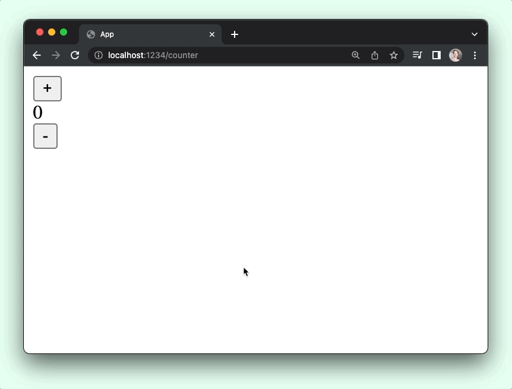

# User input

### What we'll learn

- The three pieces of __the Elm architecture__
- How to update UI when a __user clicks a button__
- How to __add more features__ to an existing app

<BrowserWindow src="./state-management/screenshot.gif" alt="Demo of the counter app example" />

## HTML that can change

All the pages we saw in the guide so far were rendering HTML. If you are building a real world application, you'll likely need to track some client-side state.

All Elm Land projects use the [Elm Architecture](https://guide.elm-lang.org/architecture/) to track the state of our frontend application.

Let's start with a simple example: __Making a counter app!__


We can create a page that can keep track of UI state using the `elm-land add` command. This time, we'll use `page:sandbox` instead of just `page`:

```sh
npx elm-land add page:sandbox /counter
```

::: details The new code that got created :point_down:

```elm
module Pages.Counter exposing (Model, Msg, page)

import Html exposing (Html)
import Page exposing (Page)
import View exposing (View)


-- PAGE


page : Page Model Msg
page =
    Page.sandbox
        { init = init
        , update = update
        , view = view
        }


-- INIT


type alias Model =
    {}


init : Model
init =
    {}


-- UPDATE


type Msg
    = ExampleMsgReplaceMe


update : Msg -> Model -> Model
update msg model =
    case msg of
        ExampleMsgReplaceMe ->
            model


-- VIEW


view : Model -> View Msg
view model =
    { title = "Counter"
    , body = [ Html.text "/counter" ]
    }
```

:::

### Understanding the code

Here's a breakdown of the new types and functions in our file:

- __`Model`__ - describes the shape of the state of our application
- __`init`__ - the initial value of the `Model` when the page loads
- __`Msg`__ - a "custom type" that lists out all the ways our model can be updated
- __`update`__ - a function that returns an updated `Model`, based on which `Msg` was sent from our `view` function
- __`view`__ - converts the latest version of our `Model` into some HTML, that can send `Msg` values

To tie these five things together, we have the `page` function, which uses `Page.sandbox`. If you have used Elm before, this is just like Elm's [Browser.sandbox](https://package.elm-lang.org/packages/elm/browser/latest/Browser#sandbox) function.

## Making a counter app

The page created with this command doesn't do anything interesting yet, so lets' update those five parts of our new Counter page to make a counter that can increment or decrement a number.

Here are the lines of code we'll need to change to get a working counter program:

<code-group>
<code-block title="src/Pages/Counter.elm">

```elm{4,27,33,42-43,49-50,52-53,64-74}
module Pages.Counter exposing (Model, Msg, page)

import Html exposing (Html)
import Html.Events
import Page exposing (Page)
import View exposing (View)


-- PAGE


page : Page Model Msg
page =
    Page.sandbox
        { init = init
        , update = update
        , view = view
        }


-- INIT


type alias Model =
    { counter : Int 
    }


init : Model
init =
    { counter = 0
    }


-- UPDATE


type Msg
    = Increment
    | Decrement


update : Msg -> Model -> Model
update msg model =
    case msg of
        Increment ->
            { model | counter = model.counter + 1 }

        Decrement ->
            { model | counter = model.counter - 1 }


-- VIEW


view : Model -> View Msg
view model =
    { title = "Pages.Counter" 
    , body =
        [ Html.div []
            [ Html.button 
                [ Html.Events.onClick Increment ]
                [ Html.text "+" ]
            , Html.div [] 
                [ Html.text (String.fromInt model.counter) ]
            , Html.button 
                [ Html.Events.onClick Decrement ]
                [ Html.text "-" ]
            ]
        ]
    }
```
</code-block>
</code-group>

Now, if we go to the browser at [http://localhost:1234/counter](http://localhost:1234/counter), we should see an interactive counter application that looks like this:



### Beyond counters

You can use the `elm-land add page:sandbox` command anytime you want your page to track local application state.

But for things like talking to a REST API, you'll want to use something a bit more advanced.

Let's cover that in the next section!