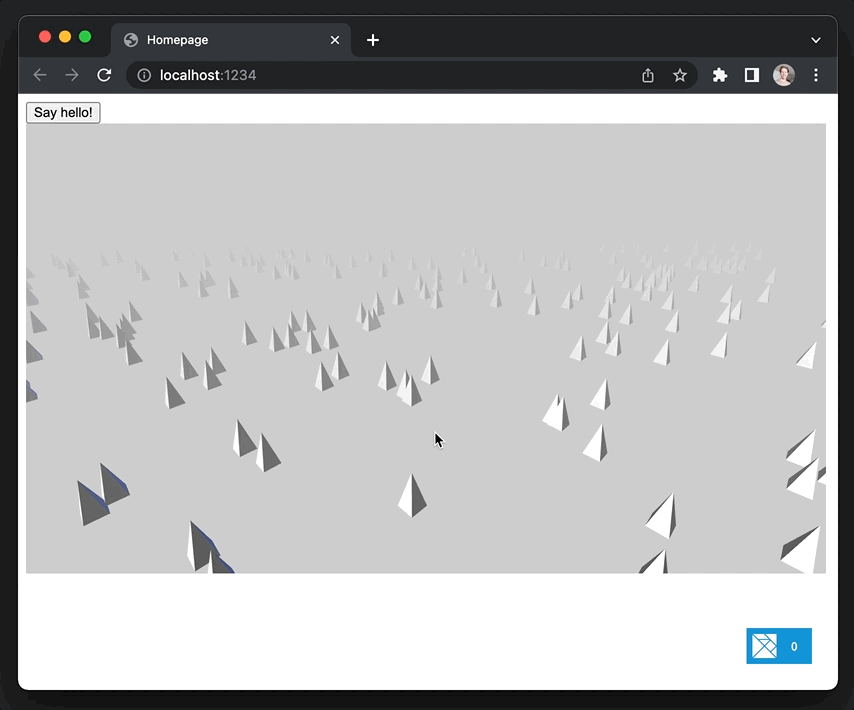
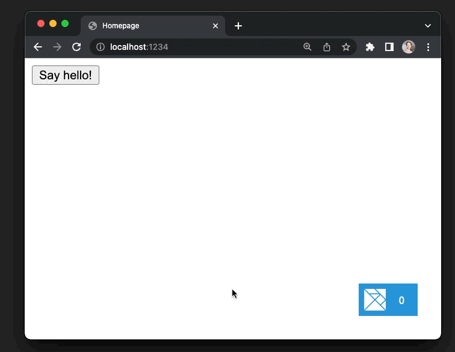

# Working with JavaScript

### What we'll learn

- How to __send initial data__ when the app starts up
- How to __call JavaScript code__ from your app
- How to use __NPM modules__ and define __web components__
- How to __use TypeScript__ instead of JavaScript
- How you can safely access __environment variables__




### Getting started

Let's create a new Elm Land project, using the `elm-land init` command:

```sh
elm-land init working-with-js
```

Now that you have a new project, you can run it locally with the `elm-land server` command:

```sh
cd working-with-js
```

```sh
elm-land server
```

Now you should see "Hello, world!" at `http://localhost:1234` 


## How Elm works with JavaScript

At a high-level, there are three ways that Elm programs can communicate with JavaScript code:

1. __Flags__ – Allows our Elm application to receive initial data before it starts up
2. __Ports__ – Allows Elm to send messages back-and-forth to your JavaScript code
3. __Web Components__ – Allows Elm to render HTML elements that do cool things!

In the Elm community, you'll hear the phrase "interop" being used. This just means "communication with JS"

This guide will introduce you to the `src/interop.js` file– the way Elm Land allows users to define all of these in their web applications.

Let's define an `src/interop.js` in our program that looks like this:

```js
// This is called BEFORE your Elm app starts up
// 
// The value returned here will be passed as flags 
// into your `Shared.init` function.
export const flags = ({ env }) => {

}

// This is called AFTER your Elm app starts up
//
// Here you can work with `app.ports` to send messages
// to your Elm application, or subscribe to incoming
// messages from Elm
export const onReady = ({ app, env }) => {

}
```

## Sending initial data

Whenever we are working with JavaScript and Elm, we'll need to write a bit of code in both languages. For sending initial data, here are the two sides of the communication that we'll need to add:

### The JavaScript side

Let's use the `flags` function to send a message to our Elm application when it starts up:

```js {4-6}
// ...

export const flags = ({ env }) => {
  return {
    message: "Hello, from JavaScript flags!"
  }
}

// ...
```

To send flags into your Elm Land application, that's all we needed to do on the JavaScript side. Next, we'll write some Elm code, so that we can receive those flags and reply to our JavaScript application.

### The Elm side

To receive the flags, we'll need to customize the `Shared` module. We can do this by using the `elm-land customize` command:

```
elm-land customize shared
```

This will move three files into our `src/` folder. For this example, we'll only need to worry about the `src/Shared.elm`.

Let's take a look at these two pieces of that file:

```elm
module Shared exposing (..)

-- ...

type alias Flags =
    {}


decoder : Json.Decode.Decoder Flags
decoder =
    Json.Decode.succeed {}

-- ...
```

In Elm Land, our `Shared` module defines:
1. `Flags` – the type of value it expects to be sent from JavaScript
1. `decoder` – how to get that value from raw JSON

By using a JSON decoder, we can make sure our Elm program doesn't crash– even if the JavaScript side sends us unexpected data.

Let's tell Elm to expect a `message` from JavaScript:

```elm {5-7,10-13}
module Shared exposing (..)

-- ...

type alias Flags =
    { message : String
    }


decoder : Json.Decode.Decoder Flags
decoder =
    Json.Decode.map Flags
        (Json.Decode.field "message" Json.Decode.string)

-- ...
```

Now that Elm knows to expect a "message" field with a `String` value from JavaScript– the result of the JSON decoding will be available to the `Shared.init` function.

We can use the `Debug.log` function to print this `Result` out the browser console. This will allow us to check if Elm received the message as expected:


```elm {7-10}
module Shared exposing (..)

-- ...

init : Result Json.Decode.Error Flags -> Route () -> ( Model, Effect Msg )
init flagsResult route =
    let
        _ =
            Debug.log "FLAGS" flagsResult
    in
    ( {}
    , Effect.none
    )

-- ...
```

If we visit `http://localhost:1234`, we'll see this message logged to our web browser's console:

```txt
FLAGS: Ok { message = "Hello, from JavaScript flags!" }
```

### Intentionally breaking stuff

Woohoo– our flags came in successfully! But what happens if JavaScript sends us something unexpected? Let's find out!

Make this change to `src/interop.js`, to try to crash the program:

```js {3}
export const flags = ({ env }) => {
  return {
    message: null
  }
}
```

What do we see in the web browser? Our Elm app is still running, and we have safely captured the problem:

```txt
FLAGS: Err (Field "message" (Failure "Expecting a STRING" <internals>))
```

Using JSON decoders to handle unsafe input from JavaScript is the easiest way to build reliable web applications, so that's the _only_ way you can work with flags in Elm Land.

## Calling JavaScript from Elm

If we want our Elm application to run some JavaScript code, we can use "ports" to send messages from Elm to JavaScript.

Ports are functions that can send JSON out to JavaScript, or send JSON from JavaScript back into Elm.

Just like with flags, this will involve adding code on both sides!

### The Elm side

Although you can define ports in any module, we recommend only defining them in your `Effect` module. Let's customize the default `Effect` module using the `elm-land customize` command:

```sh
elm-land customize effect
```

This will create a new `src/Effect.elm` file. Let's add a new `Effect` for telling JavaScript to ask the user a question.

```elm {1,3,6,12-15,21-29,40-41,52-53}
port module Effect exposing
    ( -- ...
    , openWindowDialog
    )

import Json.Encode
-- ...


type Effect msg
    = -- ...
    | SendMessageToJavaScript
        { tag : String 
        , data : Json.Encode.Value
        }


-- ...


port outgoing : { tag : String, data : Json.Encode.Value } -> Cmd msg


openWindowDialog : String -> Effect msg
openWindowDialog question =
    SendMessageToJavaScript
        { tag = "OPEN_WINDOW_DIALOG"
        , data = Json.Encode.string question
        }


-- ...

map : (msg1 -> msg2) -> Effect msg1 -> Effect msg2
map fn effect =
    case effect of

        -- ... other branches

        SendMessageToJavaScript message ->
            SendMessageToJavaScript message


-- ...

toCmd : { ... } -> Effect msg -> Cmd msg
toCmd options effect =
    case effect of

        -- ... other branches

        SendMessageToJavaScript message ->
            outgoing message

-- ...
```

Lets break down the changes we made to the default `Effect` module.

#### 1. __Defined our first port__

Using the `port` keyword in the module definition allows our module to define ports. Without it, our application will see a compiler error from Elm:

```elm {1}
port module Effect exposing
    ( -- ...
    )
```

Now that we have the `port module` set up, we can define a port called "outgoing" that will handle all events coming from Elm, out to JavaScript:

```elm {1-5}
port outgoing :
    { tag : String
    , data : Json.Encode.Value
    }
    -> Cmd msg
```

We use this port later when implementing `toCmd`, which turns our effect into a real Elm `Cmd msg`.

#### 2. __We defined a custom `SendMessageToJavaScript` effect__

Whenever we add a new `Effect msg`, we'll need to add
a variant to this custom type:

```elm {3-6}
type Effect msg
    = -- ...
    | SendMessageToJavaScript
        { tag : String 
        , data : Json.Encode.Value
        }
```

That leads to compiler errors that remind us to handle our new effect value in the existing `map` and `toCmd` functions. Here are the implementations for each:

```elm {7-8}
map : (msg1 -> msg2) -> Effect msg1 -> Effect msg2
map fn effect =
    case effect of

        -- ... other branches

        SendMessageToJavaScript message ->
            SendMessageToJavaScript message
```

```elm {7-8}
toCmd : { ... } -> Effect msg -> Cmd msg
toCmd options effect =
    case effect of

        -- ... other branches

        SendMessageToJavaScript message ->
            outgoing message
```

#### 3. __We created a function called `openWindowDialog`__

Instead of exposing the generic `SendMessageToJavaScript` value from this module, we define specific functions like `openWindowDialog` to make it easy for our code to perform side effects.

Otherwise, we might make typos with the `tag` field or get confused when encoding the JSON. Our `openWindowDialog` defines a nicer API for the rest of our code, so we expose that instead:

```elm {3,8-13}
port module Effect exposing
    ( -- ...
    , openWindowDialog
    )

-- ...

openWindowDialog : String -> Effect msg
openWindowDialog question =
    SendMessageToJavaScript
        { tag = "OPEN_WINDOW_DIALOG"
        , data = Json.Encode.string question
        }
```

Now that we have defined our new `outgoing` port in Elm, we can use it in our JavaScript code.

### The JavaScript side

Let's come back to `src/interop.js`, and add a few lines to the existing `onReady` function:

```js {2-7}
export const onReady = ({ app, env }) => {
  if (app.ports && app.ports.outgoing) {
    app.ports.outgoing.subscribe(({ tag, data }) => {
      // Print out the message sent from Elm
      console.log(tag, data)
    })
  }
}
```

This bit of JavaScript code checks for the presence of `app.ports.outgoing` before subscribing to messages coming from Elm.

When a new message comes in, we should see a new log in the console with the data sent from Elm. 


### Running JavaScript at the click of a button

As one last step, let's add a "Say hello" button to the homepage, so we can see our new port in action! Let's start by replacing the homepage with one that can send effects:

```sh
elm-land add page /
```

Let's add in a button on the page that will send our new `Effect.openWindowDialog`:

```elm {3,9,15-18,}
module Pages.Home_ exposing (Model, Msg, page)

import Html.Events
-- ...

-- ...

type Msg
    = UserClickedButton


update : Msg -> Model -> ( Model, Effect Msg )
update msg model =
    case msg of
        UserClickedButton ->
            ( model
            , Effect.openWindowDialog "Hello, from Elm!"
            )

-- ...


view : Model -> View Msg
view model =
    { title = "Homepage"
    , body =
        [ Html.button
            [ Html.Events.onClick UserClickedButton
            ]
            [ Html.text "Say hello!" ]
        ]
    }
```

Now when we visit `http://localhost:1234` in our browser, we'll see a message logged to the console:

```
OPEN_WINDOW_DIALOG Hello, from Elm!
```

This means our Elm application is successfully running JavaScript code. Let's make it more interesting by using `window.alert` when the tag received is `"OPEN_WINDOW_DIALOG"`.

```js {4-11}
export const onReady = ({ app, env }) => {
  if (app.ports && app.ports.outgoing) {
    app.ports.outgoing.subscribe(({ tag, data }) => {
      switch (tag) {
        case 'OPEN_WINDOW_DIALOG':
          window.alert(data)
          return
        default:
          console.warn(`Unhandled outgoing port: "${tag}"`)
          return
      }
    })
  }
}
```



## Using web components

Another great way to work with existing JavaScript libraries is to define custom [web components](https://developer.mozilla.org/en-US/docs/Web/Web_Components) that are rendered within your Elm application.

Just like a `<div>` or a `<span>`, you can render a `<my-custom-thing>` tag within your Elm application. That HTML element can run be used to safely embed your own JavaScript components.

It's common to do this for things like Google Maps, or if you're embedding an existing React or Vue application within a mostly Elm app.

### Let's use Three.js!

For this example, we are going to use [the _amazing_ Three.js library](https://threejs.org/) to embed a cool, interactive 3D scene in our Elm Land application.

Together we'll define a custom `<forest-demo>` component that will render this interactive Three.js example, complete with orbit controls and some example shapes:


### The JavaScript side

#### 1. Installing NPM modules

To work with JavaScript modules, we'll need to track our dependencies in a `package.json` file. This will make it easy to run `npm install` and get them again later.

Let's create a `package.json` file using `npm`:

```sh
npm init -y
```

This creates a new `package.json` file, and now we can install the `three` package as a NPM dependency:

```sh
npm install --save three
```

#### 2. Adding the web component

Next, we'll want to create a new file at `src/web-components/forest-demo.js`.

Copy the example snippet below, which is defined as a new custom web component:

```js
// 
// This code was taken from this Three.js example:
// https://github.com/mrdoob/three.js/blob/master/examples/webgl_lightprobe.html
//

import * as THREE from 'three'
import { OrbitControls } from 'three/addons/controls/OrbitControls.js'

window.customElements.define('forest-demo', class extends HTMLElement {
  connectedCallback() {
    let size = {
      width: 800,
      height: 450
    }

    let camera, controls, scene, renderer
    let self = this

    init()
    animate()

    function init() {
      scene = new THREE.Scene()
      scene.background = new THREE.Color(0xcccccc)
      scene.fog = new THREE.FogExp2(0xcccccc, 0.002)

      renderer = new THREE.WebGLRenderer({ antialias: true })
      renderer.setPixelRatio(window.devicePixelRatio)
      renderer.setSize(size.width, size.height)

      self.appendChild(renderer.domElement)

      camera = new THREE.PerspectiveCamera(60, size.width / size.height, 1, 1000)
      camera.position.set(400, 200, 0)

      // controls
      controls = new OrbitControls(camera, renderer.domElement)
      controls.listenToKeyEvents(window)
      controls.enableDamping = true
      controls.dampingFactor = 0.05
      controls.screenSpacePanning = false
      controls.minDistance = 100
      controls.maxDistance = 500
      controls.maxPolarAngle = Math.PI / 2

      // world
      const geometry = new THREE.CylinderGeometry(0, 10, 30, 4, 1)
      const material = new THREE.MeshPhongMaterial({ color: 0xffffff, flatShading: true })

      for (let i = 0; i < 500; i++) {
        const mesh = new THREE.Mesh(geometry, material)
        mesh.position.x = Math.random() * 1600 - 800
        mesh.position.y = 0
        mesh.position.z = Math.random() * 1600 - 800
        mesh.updateMatrix()
        mesh.matrixAutoUpdate = false
        scene.add(mesh)
      }

      // lights
      const dirLight1 = new THREE.DirectionalLight(0xffffff)
      dirLight1.position.set(1, 1, 1)
      scene.add(dirLight1)

      const dirLight2 = new THREE.DirectionalLight(0x002288)
      dirLight2.position.set(-1, -1, -1)
      scene.add(dirLight2)

      const ambientLight = new THREE.AmbientLight(0x222222)
      scene.add(ambientLight)

      window.addEventListener('resize', onWindowResize)
    }

    function onWindowResize() {
      camera.aspect = size.width / size.height
      camera.updateProjectionMatrix()
      renderer.setSize(size.width, size.height)
    }

    function animate() {
      requestAnimationFrame(animate)
      controls.update()
      render()
    }

    function render() {
      renderer.render(scene, camera)
    }
  }
})
```

Now that we have that web component file, we'll need to import it into our `src/interop.js` file.

#### 3. Using our web component

Back in `src/interop.js`, and this line to the top of your file:

```js {1}
import './web-components/forest-demo.js'

// ...
```

### The Elm side

Now that the new web component is defined, adding it to our Elm application will be easy. 

In our `src/Pages/Home_.elm` file, let's add this line to our `view` function, just below our "Say hello!" button from earlier:

```elm {14}
module Pages.Home_ exposing (Model, Msg, page)

-- ...


view : Model -> View Msg
view model =
    { title = "Homepage"
    , body =
        [ Html.button
            [ Html.Events.onClick UserClickedButton
            ]
            [ Html.text "Say hello!" ]
        , Html.node "forest-demo" [] []
        ]
    }
```

That's it! After adding that one line of Elm, you'll see the 3D scene is ready to interact with at `http://localhost:1234`:


#### Rules for Web Components

Web components are a great way to add JavaScript functionality to an Elm Land application. Here is some advice when using them in your own projects:

1. __Don't make Elm and JS overwrite each other__

    In this example, our JavaScript component used `this.appendChild` to insert
    elements inside of itself. For that reason, we made sure to
    use `[]` on the Elm side when defining the child list.

    If we didn't, Elm will try to overwrite the JS elements, leading to
    problems with the Virtual DOM and page rendering.

    ```elm
    -- ✅ DO
    Html.node "forest-demo" [] []

    -- 🚫 DON'T
    Html.node "forest-demo" []
        [ Html.text "Hello from inside <forest-demo>!!" ]
    ```

2. __Check out Luke's awesome talk!__

    Luke Westby introduced how to reliably use web components with Elm in
    his [Elm Europe 2018 talk](https://www.youtube.com/watch?v=tyFe9Pw6TVE).

    This talk covers how to add HTML attributes, listen for changes to properties, and more!
    ( I can't recommend this resource enough, I reference it all the time )

## Using TypeScript

All of the examples below were using a `src/interop.js` file to integrate with our Elm application. But what if you wanted to use [TypeScript](https://www.typescriptlang.org) instead?

In Elm Land, you can upgrade _any_ project to use TypeScript by renaming the file from `interop.js` to `interop.ts`.

It's really that easy!

### What you can expect

1. __TypeScript compiler errors__ will be displayed in your web browser on save, just like the Elm ones!
2. __If you run `elm-land build`__, the command will let you know about any TypeScript compiler errors and fail the build.
3. You can __add your own [tsconfig.json](https://www.typescriptlang.org/tsconfig) file__ to the root of your project (alongside `elm.json` and `package.json`), and Elm Land will automatically use that configuration.


::: tip Adding a `tsconfig.json`?

We recommend using this minimal configuration as a starter, to prevent emitting unused JS files when Elm Land automatically checks your project during `elm-land server` and `elm-land build`:

```json
{
  "files": ["src/interop.ts"],
  "compilerOptions": {
    "lib": ["es6", "dom"],
    "noEmit": true,
    "strict": true
  }
}
```

:::

## Environment variables

Elm Land allows you to safely access any environment variables from your `src/interop.js` file.

You may have already spotted the `env` variable available to both the `flags` and `onReady` functions:


```js {3,9}
// ...

export const flags = ({ env }) => {
  // ...
}

// ...

export const onReady = ({ app, env }) => {
  // ...
}
```

By default, for security reasons, __no environment variables__ are available. You'll need to edit your `elm-land.json` file's [app.env](./config/elm-land-json.md#appenv) property to allow your Elm application to access a given variable.

::: warning Be thoughtful about what you expose!

Any environment variables you expose in `app.env` will be accessible to _anyone_ with access to your website. Be sure to keep private information or secrets out of your `elm-land.json`

:::

Here's an example of exposing the `NODE_ENV` variable to your frontend:

```json {3}
{
  "app": {
    "env": [ "NODE_ENV" ],
    ...
  }
}
```

Now that `NODE_ENV` has been listed as a variable, you'll have access to it within the `env` value passed into your Elm application.

You can test this out yourself in `src/interop.js`:

1. Add this `console.log` within your `flags` function to see the value of `env`:

    ```js {4}
    // ...

    export const flags = ({ env }) => {
      console.log(env)
      // ...
    }

    // ...
    ```

2. Re-running `elm-land server` with your environment variable set:

    ```sh
    NODE_ENV=production elm-land server
    ```

3. Check your web browser's console output:

    ```txt
    { "NODE_ENV": "production" }
    ```

### Sending environment variables to Elm

As seen earlier in this guide, you can send this environment variable as [initial data via flags](#sending-initial-data) or define an [incoming port](https://guide.elm-lang.org/interop/ports.html) that sends it in at a later time.

From there, it's common to store your environment variables in your `Shared.Model`, which makes them accessible to any page that needs to use them!
