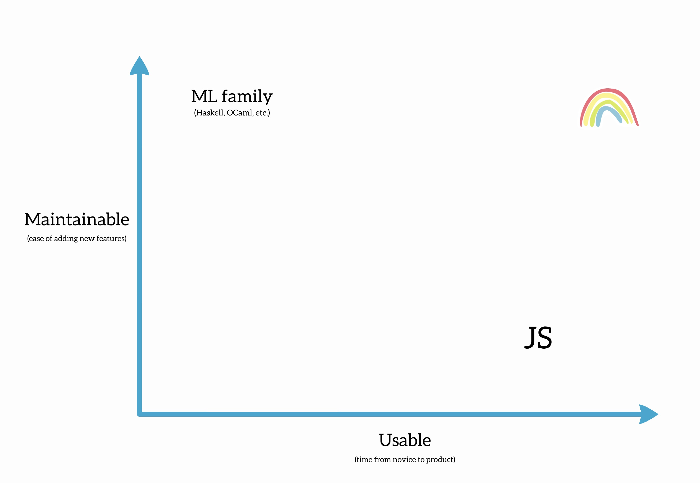
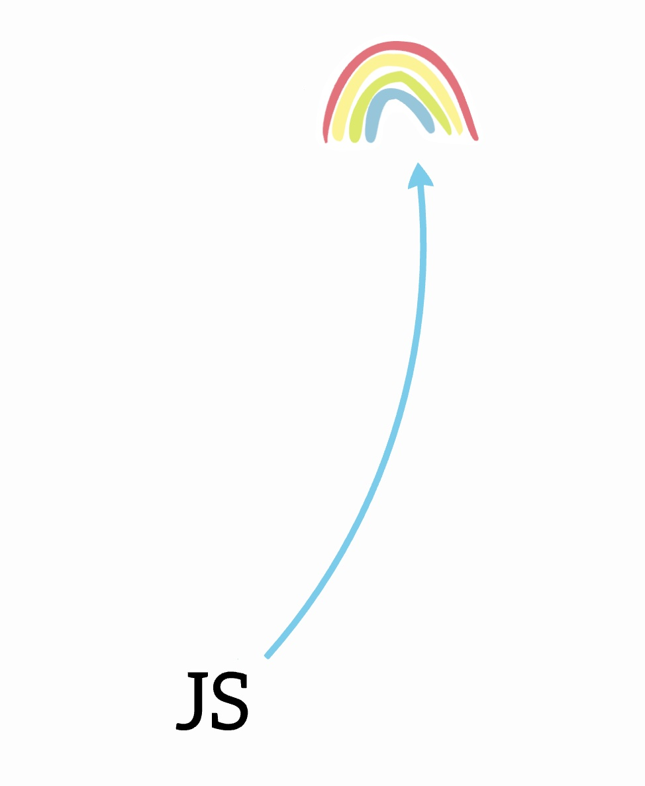

# 👋 Hello, world!

Written by _Ryan_ on _October 4th, 2022_

## Motivation

### Let's be Mainstream!

In July 2015, Evan Czaplicki gave a presentation called ["Let's be Mainstream!"](https://www.youtube.com/watch?v=oYk8CKH7OhE). That talk was my first introduction to the Elm programming language. Evan started off by asking the audience (of mostly functional programmers) a question:

> “If typed functional programming is so great, how come nobody uses it?”

His light-hearted question was greeted with laughter, and it resonated with the room full of functional programming enthusiasts. Evan proceeded to walk through a brief "History of programming" from the perspective of folks using popular languages like Java or JavaScript, and got to a point in his presentation where he showed this graph:

In the bottom-right corner, Evan added "JavaScript". With a quick demo, he showed the room how JavaScript is __incredibly usable__. Evan switched to Google Chrome, opened the dev console, typed `4 + 4`, hit enter, and the number `8` printed to the screen. Getting started with JS is really _that_ easy!

In the top-left corner, he added "ML family" (things like Haskell or OCaml) and explained how despite having a steep learning curve, their users are able to make applications that are easy to refactor and maintain.

Evan suggested that there's an ideal place, somewhere in the top-right corner of the graph, where a language could be __both usable _and_ easy to maintain__. To represent that ideal spot, Evan drew a little rainbow:

Evan asked the audience another question: how do we get __those functional programmers__ to this happy place? After a brief pause, he revealed that it was a trick question: this goal might not make sense.

Why isn't this Evan's goal? Here's how he explains the problem in his talk:

<!-- > <InlineEmoji url="/images/news/hello-world/evan-shrug.jpg" /> -->
> “If you make a really nice frontend programming language for people, who don't do frontend programming... then uh... ” :shrug:

Instead, Evan suggested a different goal: Set out to __improve the maintainability__ for the huge number of folks doing frontend web development. This led to a brand new arrow being drawn on the graph instead:

At its core, Elm is about making reliable apps more accessible to everyone. The goal of _Elm Land_ is to return to the guiding principles that Evan outlined in his talk:
- __Gradual learning__ - Make things welcoming for folks getting started
- __Communication__ - Plainly communicate benefits and tradeoffs with concrete examples
- __Culture__ - Emphasize a welcoming community that builds stuff and shares results
- __Usage-driven design__ - Limit new features to real issues encountered in practice

The ["Let's be Mainstream!"](https://www.youtube.com/watch?v=oYk8CKH7OhE) talk has a special place in my heart, because it assured me that Elm wasn't made for super-smart functional programmers. It was designed for the everyday JavaScript developer, like me.

### Getting inspired by JavaScript

Fast-forward to 2022, and so much of the JavaScript landscape has evolved. Projects like [TypeScript](https://typescriptlang.org) have taken off, and many folks have leaned into the tradeoff of writing extra code in exchange for better refactoring experiences.

In terms of JS frameworks, React and Vue.js are still overwhelmingly popular– and for __great__ reason! The ecosystem of tooling around each framework has also evolved to keep pace with developers' needs. Each of these communities have access to great libraries, guides, dev servers, and application frameworks.

For example, the Vue.js community has an application framework called [Nuxt.js](https://nuxtjs.org). Nuxt makes it easy for beginners to get up-and-running with only a few terminal commands. Each new concept in the framework comes with comprehensive guides on how to design components, work with APIs, and handle common frontend challenges like user authentication.

As a newcomer to a JS community, trying to choose a framework can be intimidating. Projects like Nuxt.js do an excellent job of convincing folks they can build awesome stuff!

Luckily for Elm Land, the success of the JavaScript ecosystem means that the _Elm Land_ project has a lot sources of inspiration to draw from. What concepts are easy to learn? What are common challenges these projects help address?

### Elm's wonderful libraries

In addition to the core Elm tooling, the Elm community has created plenty of great tools too! Here's a handful of some of the more popular ones:
- __elm-ui__ - a way to build UIs without CSS
- __elm-review__ - a powerful analysis tool that can lint, refactor, and eliminate unused code
- __elm-graphql__ - a CLI tool that generates GraphQL from Elm code
- __elm-spa__ - a framework for building single page apps

Just like with libraries from the JS ecosystem, each of these tools were built by a separate person. For example, [Matt Griffith](https://github.com/mdgriffith) built _elm-ui_ and [Dillon Kearns](https://github.com/dillonkearns) built _elm-graphql_ completely in isolation from one another. Despite the lack of coordination, both projects still plug-in well to any Elm codebase, because they each focused on tacking a specific problem.

If we look at the popular application frameworks from the JS ecosystem, we see that the folks behind _Nuxt.js_ or _Next.js_ are answering a different question: __How do I put all these libraries together to build stuff?__

In addition to developer tooling, Elm Land offers an opinionated way to build your next web application. This is based on years of building real Elm applications, and inspired by the wonderful tools in the JS ecosystem.

## Roadmap

At the time of writing, Elm Land is still in its early stages. The current release, `v0.17.1`, only addresses a handful of problems. To make a web framework as useful as something like Nuxt.js– we'll need to build more than ["Hello world"](../guide/index.md) or ["Talking to the PokeAPI"](../guide/rest-apis.md).

So when will Elm Land be ready for `v1.0.0`? __When we can create GitHub from scratch.__

GitHub is a great app to build, because it has plenty of features and real-world problems that need solving. Here are some of the features we will need to make a GitHub clone:
- Creating a new project
- Adding new pages
- Supporting stateful layouts
- Supporting catch-all routes (`/:user/:repo/blog/:branch/*`)
- Talking to the [GitHub GraphQL API](https://docs.github.com/en/graphql) with the `@elm-land/graphql` plugin
- Building [GitHub's design system](https://primer.style/design/foundations/color) from scratch with the `@elm-land/ui` plugin
- Deploying an app to production

## Community

One of the biggest things I'm excited about is creating a welcoming space for the Elm Land community. For folks using Elm Land, I'm hoping that space can emphasize these core values:

1. Preferring conversations to code changes
1. Building and sharing real projects
1. Being friendly, welcoming, and kind!

Let's quickly dive into more details for each of those values!

###  Preferring conversations to code changes

Many successful open source projects are centered around GitHub. The Elm Land GitHub repo is a great place to find examples, browse source code, and see what's in progress.

Whether it's sharing new feature ideas, giving feedback, or reporting bugs, everything should start with a conversation in the [offical Elm Land Discord server](https://discord.gg/vnmYFfySbH).

The community Discord is a dedicated space designed to help folks learn, contribute, and share results with one another. Stop by and say hello!

### Building and sharing real projects

Elm Land is about building real things, and so is the official guide!

In each section, we cover building a full project from scratch. At first, the project is just an app that says "Hello, world". As you go, the guide is structured to help you build more advanced projects, and introduce you to features of the framework in context.

I want to foster the "build real things" mindset in the Elm Land community, and encourage everyone to share what they build!

My __favorite__ kind of tweets have always been the ones that show off cool projects built with Elm. If you are excited about your Elm Land application, game, or anything else– be sure to tag [@ElmLand_](https://twitter.com/elmland_) when you share it. I cannot wait to see the cool stuff that you make!

### Being friendly, welcoming, and kind!

Finally, I want to make sure to set clear expectations up front! Currently, the Elm Land team is made up of a few people, working on nights and weekends, building free stuff for the internet.

All the source code, guides, examples, and design docs are publically available on [the official repo](https://github.com/elm-land/elm-land). You can read or modify _anything_ you'd like for your own personal use, and forks are totally welcome!

Even though the framework is free to use, choosing Elm Land for your next project does not come with free labor. __The mental health and personal well-being of _all_ Elm Land community members is my top priority__. I love collaborating with wonderful people, and I want them to have a positive experience.

### Want to join the project?

Reporting bugs, fixing documentation, adding features, and sharing your experience using Elm Land are _all_ forms of contribution. Hop in the `#welcome` channel of [the Elm Land Discord server](https://discord.gg/vnmYFfySbH) and introduce yourself– I'm excited to meet you!

We're all here to have a good time, build cool stuff, and make friends along the way. __Let's be mainstream!__
