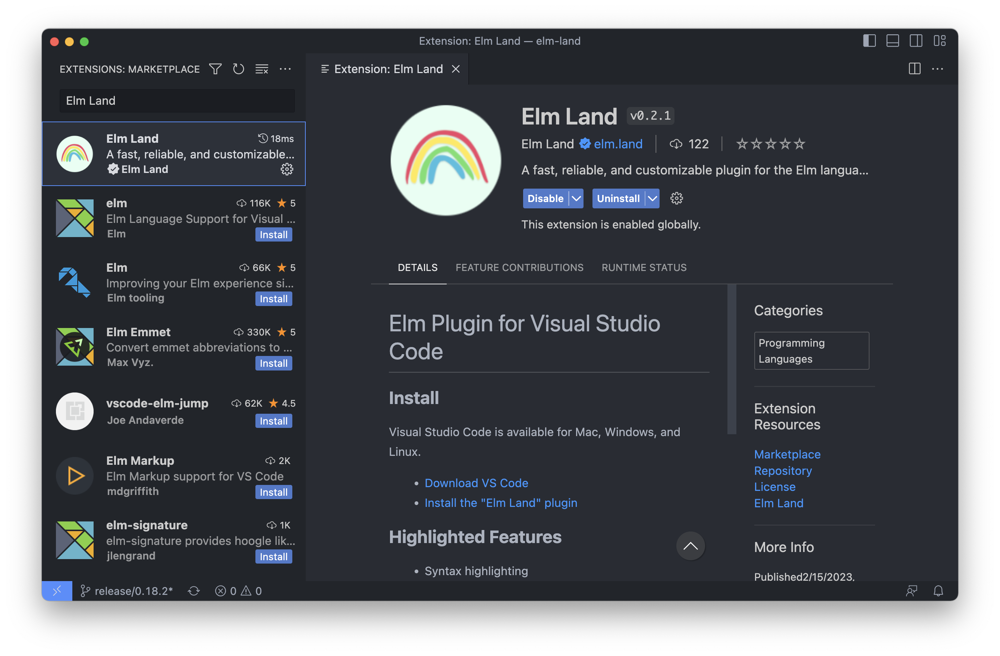
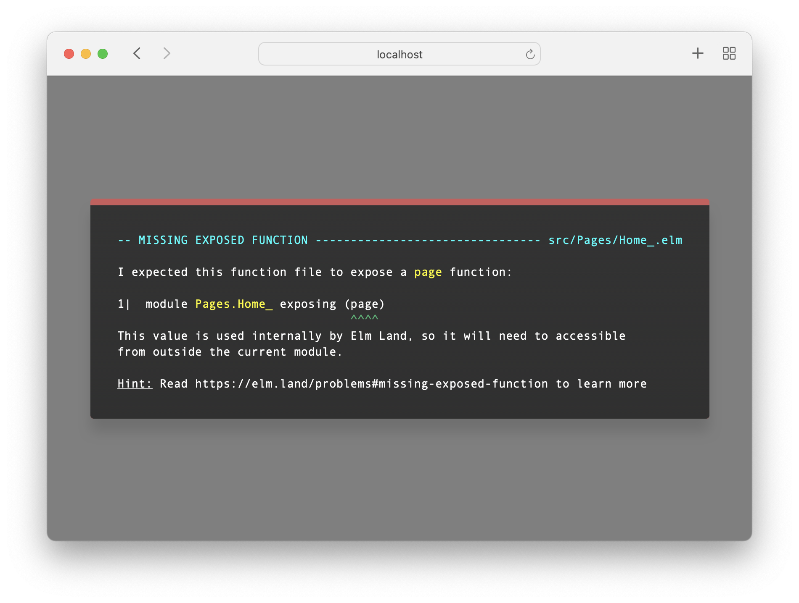
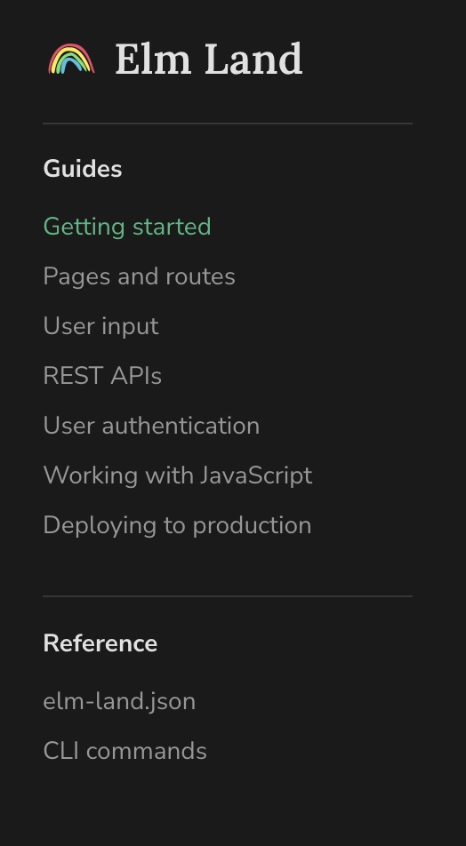
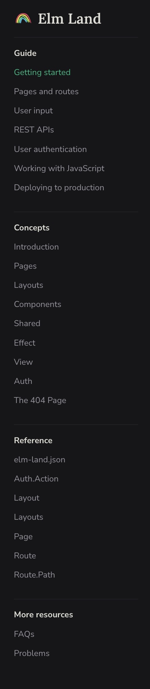
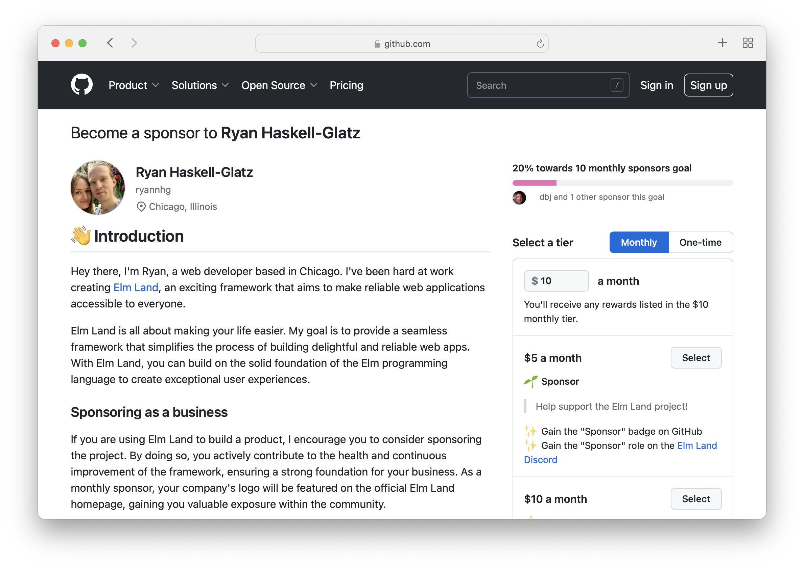

# 🇯🇲 Elm Land: The Sai Update

Written by _Ryan_ on _June 19th, 2023_

## Is Elm hard to learn?

In January, I watched a React developer learn Elm for the first time, live on Twitch. That developer is [Sai](https://www.twitch.tv/saiforceone), a fullstack web engineer living in Kingston, Jamaica. After Sai saw the Elm Land homepage, he dedicated an entire stream to trying out Elm for the first time.

Sai began with the ["Getting Started" guide](/guide/). __Within seconds__, he had a brand new Elm application running in his web browser. Getting to "Hello, world!" was easy, and made Sai excited to learn more.

As I continued watching, I started to notice a few obstacles along the way. Elm Land was designed to make Elm accessible to everyone, especially first-time learners like Sai. For that reason, I began to take notes on which areas needed the most improvement.

By the end of Sai's journey, I had my list of areas to improve Elm Land.

## Introducing Elm Land v0.19.0

Today, I'm excited to announce Elm Land v0.19.0. Unlike many previous updates, this one goes beyond the `elm-land` CLI command. Sai's experience learning wasn't just about running a dev server, or scaffolding out a new page. 

If I wanted Elm Land to be awesome, the full developer experience needed to be taken into account.

### Editor plugin issues

Before Sai could begin following the step-by-step guides, he needed to set up his editor. Like many web developers, Sai used [Visual Studio Code](https://code.visualstudio.com/) as his editor of choice. 

After installing the recommend Elm plugin, Sai ran into some unexpected issues. The plugin was reporting outdated errors that led him down a troubleshooting rabbit hole. Ultimately, the solution was to restart VS Code to make those errors go away.

After that, Sai proceeded through the Elm Land guide. Being familiar with other plugins, he tried to use some features like "Rename all", but it didn't rename files as expected. He used some Git tricks to get things back in a working state, and carried along through his journey.

#### The Elm Land VS Code plugin

To help provide a reliable experience, this release comes with an official [Elm Land VS Code plugin](https://marketplace.visualstudio.com/items?itemName=elm-land.elm-land):

The Elm Land plugin has been written from the ground-up in TypeScript, and provides you feedback directly from the Elm compiler itself. At [Vendr](https://www.vendr.com/), we've been using it with our 600k+ lines of code application, and haven't experienced any performance issues.

You can learn more about features, performance benchmarks, and meet the wonderful folks that helped make this possible by visiting the official repo at [@elm-land/vscode](https://github.com/elm-land/vscode). To report issues, contribute a feature, or make suggestions, stop by the `#vscode` channel of our [Elm Land Community Discord](https://join.elm.land).

### Errors in strange places

Elm is known for having [really helpful error messages](https://twitter.com/ID_AA_Carmack/status/735197548034412546?s=20). Unfortunately, in Elm Land v0.18.0, those would show in __generated code__ outside of Sai's control. 

As a first-time user of the framework, it wasn't clear how to resolve the issues.

After some troubleshooting, Sai realized that Elm Land had some expectations that weren't being made clear. As designer of the framework, I had a responsibility to make sure the quality of Elm Land was on par with the quality of the Elm language itself.

#### Elm Land error messages

To prevent that problem from happening again, Elm Land now provides it's own set of problems, designed to look and feel just like Elm's core error messages:

For example, the error above is letting someone know that removing the exposed `page` function will make this page unable to render. Users can learn more about theses errors in more detail on [the new "Problems" page](/problems).

After upgrading to Elm Land v0.19.0, you should never see an error message for a generated file again. Shout-out to Dillon Kearns, who had previously explored this idea in [elm-pages](https://github.com/dillonkearns/elm-pages)!

## Improvements for everyone

In addition to learning from Sai's experience, I also added several features inspired by the community members in our Discord. Folks using Elm Land had shared some limitations with the guide and CLI they encountered in v0.18.x in the `#suggest-a-feature` and `#improve-the-docs` channels.

Here's how Elm Land made life easier for those lovely people:

### Better guides, more examples

Elm Land is more than just a CLI tool or an editor plugin. The true value of the framework is in providing clear guides for beginners and helpful documentation for experienced Elm Land engineers.

The initial pass of the guide was targeted towards folks coming from JS. If you already knew Elm, it was hard to understand what Elm Land added to the core experience. After a huge overhaul to the documentation, both newcomers and Elm folks alike will have an easier time finding what they need:

__Before__ (Elm Land `v.0.18.0`) | __After__ (Elm Land `v.0.19.0`)
:-- | :--
 | 

In addition to the original guide, we've added some new sections:

- __[Concepts](/concepts/)__ - An overview of how Elm Land works, the core concepts, and why you might customize certain modules.

- __[Reference](/reference/elm-land-json)__- API documentation for Elm Land modules like `Route` and `Page` that you'll use day-to-day in your applications.

- __[FAQs](/faqs)__ - Common questions about the Elm Land project itself, including links to the official roadmap.

This update also comes with an [Examples](/examples/)__ gallery. This includes all the [official examples](https://github.com/elm-land/elm-land/tree/main/examples) from the Elm Land repo.

<BrowserWindow src="/images/news/examples-gallery.jpg" alt="A preview of the examples page" />

If you would like to feature your project in the Examples gallery, please let us know in the `#cool-projects` channel in the [Elm Land Community Discord](https://join.elm.land). We're more than happy to showcase the wonderful stuff you make!

### New framework features

This update also comes with some core upgrades to the CLI, driven by feedback from folks in the Community Discord:

1. __URL Hooks__ – Allows pages and layouts to respond to changes in the URL. This is helpful when using query parameters to filter data or perform other effects in response to a URL change.

2. __Layouts upgraded__ – Layouts now support the ability to include a `msg` parameter. This is helpful for embedding actions in a layout's header or sidebar, that fire events to the page using the layout.

For a deeper dive on how to use these in practice, be sure to visit [the official guide](/guide/).

If you were previously using _elm-spa_, Elm Land's predecessor, now is a great time to upgrade! In terms of framework features, Elm Land has exceeded what was possible in _elm-spa_. Additionally, the Elm Land error messages are here to give you more meaningful feedback as you upgrade your project.

## What's next for Elm Land?

That was a big update, but Elm Land is just getting started. Since Elm Land's ["Hello, world!" post](./hello-world.md), the goal has been to share the joy of reliable web app development with as many folks as possible. 

By providing __solid developer tooling__, __beginner-friendly learning resources__, and __clear conventions__ for scaling apps, developers are empowered to build amazing things.

The future of Elm Land will continue to involve more real world example apps and improved guides. In the short term, future updates will help folks answer questions like: 

- "How do I work with a GraphQL API?"
- "How can I upgrade an existing Elm project?"
- "How can I prevent navigation when a user is filling out a form?"

### How you can help

If you believe in Elm Land's vision, and want to have a meaningful impact on the continued growth of the project, today's release comes with one last feature: An official [GitHub Sponsors](https://github.com/sponsors/ryannhg/) page:

By supporting my work on GitHub, I can dedicate more of my time to providing you with practical guides, resources, and better tooling for building web apps. Any contribution you can make is deeply appreciated, and many tiers come with unique perks as a thank you for your support.

If your business is using Elm Land in production, consider joining the special "Founder Sponsor" role. In addition to being featured on the Elm Land website, that tier helps ensure that the framework your product relies on stays healthy and actively maintained.

Thank you for considering [supporting the Elm Land project](https://github.com/sponsors/ryannhg/)!

---

Special shout-out to [Dirk Johnson (@dbj)](https://github.com/dbj) and another generous (but anonymous) sponsor for supporting Elm Land before the GitHub Sponsors page was even announced! 💖

### We'll get there together!

The best part of Elm Land is our community. The [Elm Land Community Discord](https://join.elm.land) is a friendly place where folks use channels like `#cool-projects` to share what they're building. It brightens my day to see the great work that folks share in that channel, and how everyone supports one another. 

I hope you enjoy the latest Elm Land release, and I can't wait to see the cool stuff you build. 

__Let's be mainstream!__ 🌈
