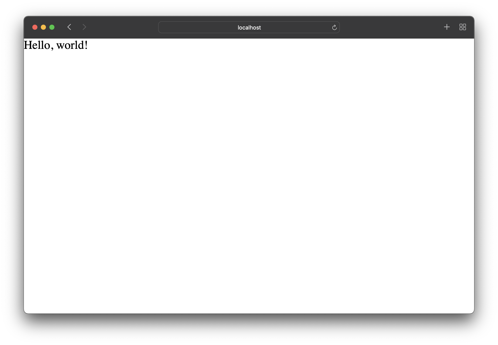
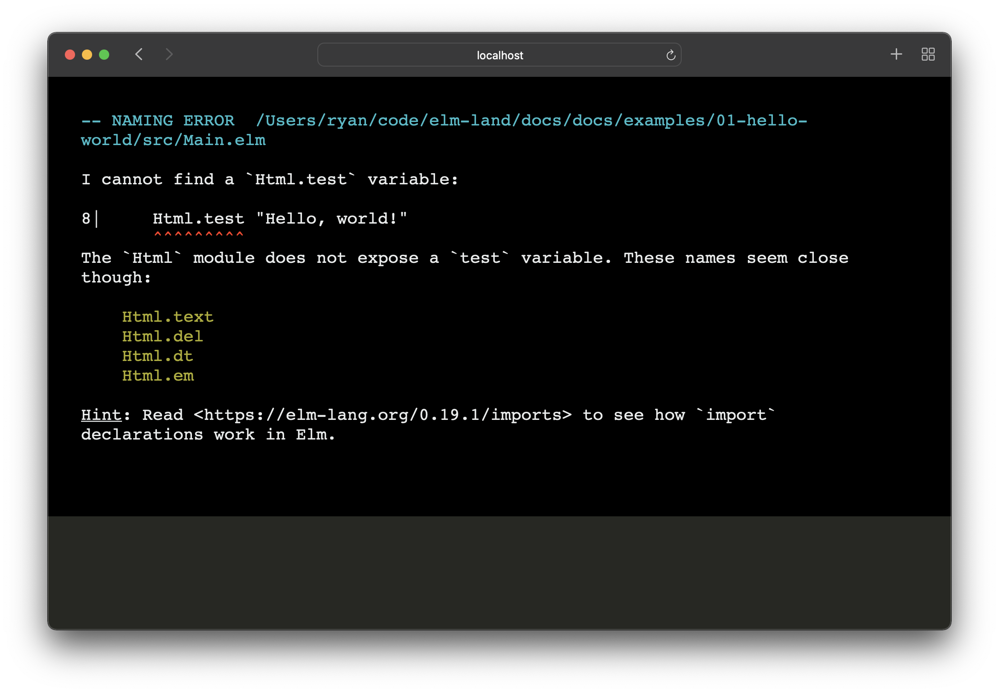
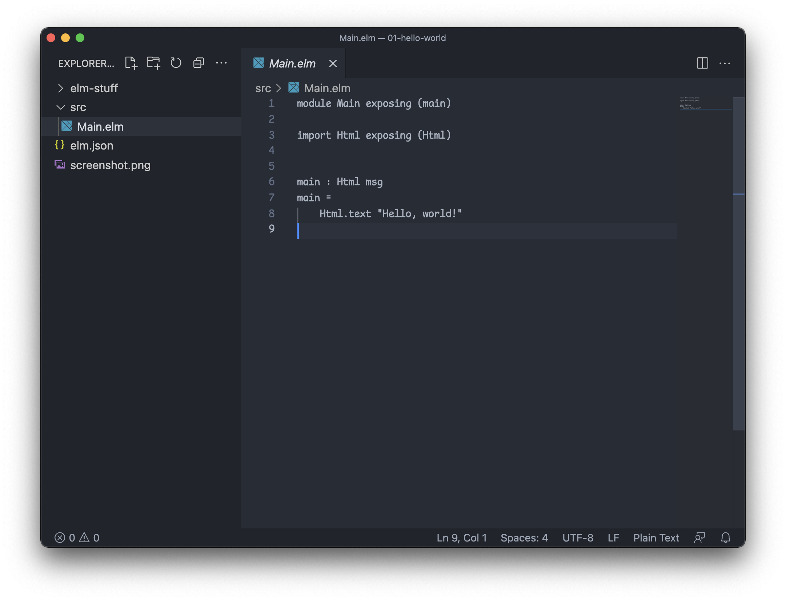
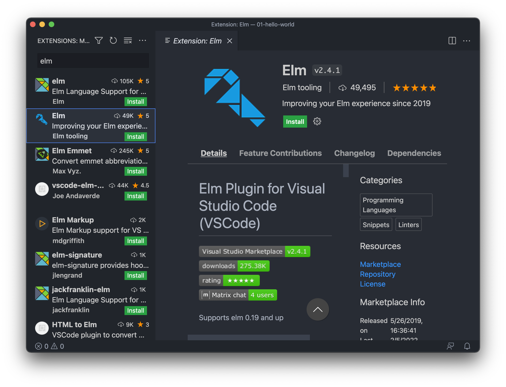
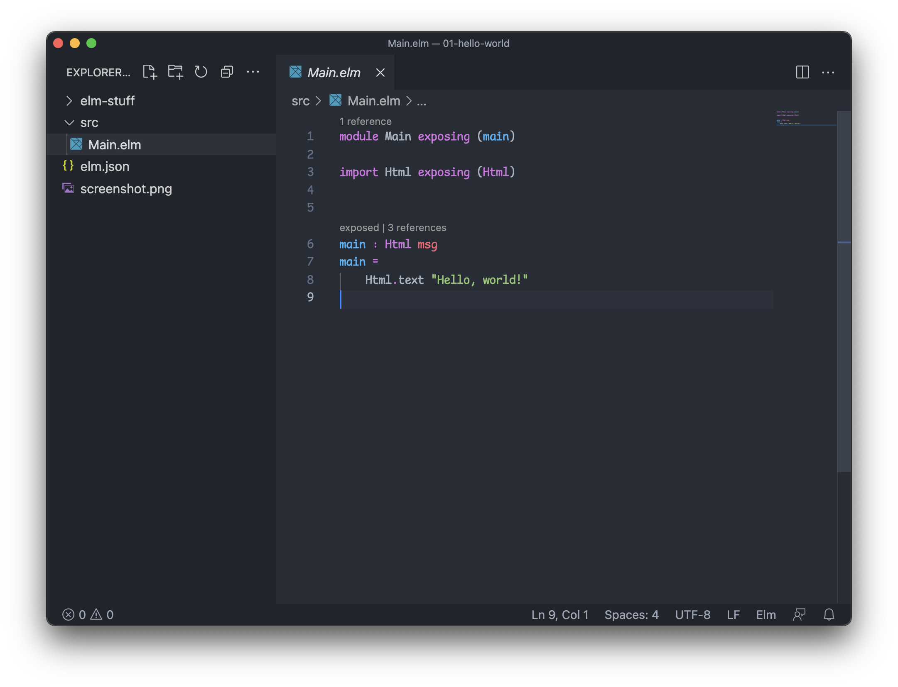
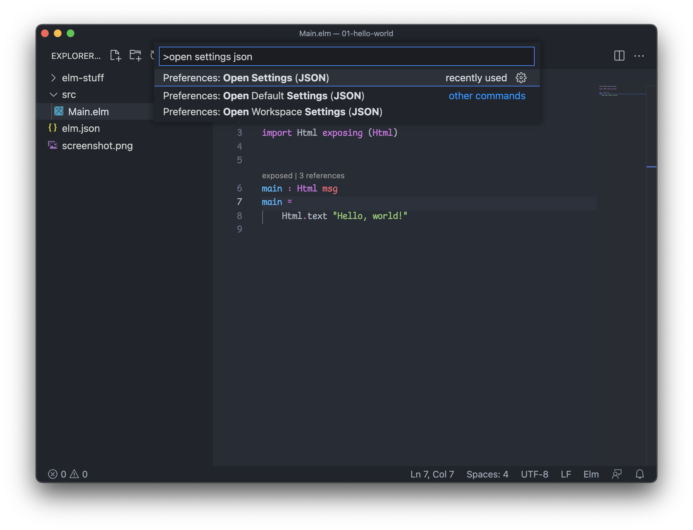

# Introduction

The goal of _Elm Land_ is to solve common problems folks run into when creating web apps. Traditionally, frontend web development comes with an overwhelming amount of decisions to make. Getting set up with the right tooling and project configuration can be intimidating, and the internet has strong opinions about which tool is best for the job. By providing guides and conventions, we can get frontend devs up-and-running with confidence.

In order to create real-world applications, there are a few things that should be easy:

1. __Scaling an application__ - Understanding how to organize files, share data between pages, and reuse your application code.
1. __Talking to servers__ - Communicating with REST APIs, GraphQL endpoints, and how to authenticate HTTP requests for those backend APIs.
1. __Working with UI__ - Building components with a solid foundation, solving common CSS layout problems, and learning how to design your UI modules.

## Starting simple

Let's begin by looking at how a normal Elm application is created. [Elm](https://elm-lang.org) allows you to create a new project, compile it to JS, and even run a server with __one__ command. If you have [Node.js](https://nodejs.org/) installed, you can create a new Elm project using this command:

```sh
npx elm init
```

This creates an `elm.json` file and an empty `src` folder. The `elm.json` file is just like Node's `package.json` file. Its job is to track all your project's dependencies– so you or a friend can easily get your app running on another computer.

Let's take a quick look at the `elm.json` file to understand it better:

<code-group>
<code-block title="elm.json">
<<< @/examples/01-hello-world/elm.json
</code-block>
</code-group>

Here's a breakdown for what each section means:
- __`type`__ - This field says you are building an Elm application (has a different format if building an Elm package)
- __`source-directories`__ - This field describes where Elm will look for your code. By convention, Elm developers use the `src` folder.
- __`elm-version`__ - This is the current version of Elm your project is running. At the time of writing, the latest version is 0.19.1.
- __`dependencies`__ - These are the [Elm packages](https://package.elm-lang.org/) your project depends on to run. Just like NPM, Elm has its own packages– but for Elm code instead of JavaScript. To install more packages, we use the `elm install` command.
  - __`direct`__ - Your direct dependencies can be imported in your app's code.
  - __`indirect`__ - Your indirect dependencies are imported inside your "direct dependencies".
- __`test-dependencies`__ - If using `elm-test`, these are additional dependencies that your tests can import.


### Your first Elm program

To make a "Hello, world!" program, you'll create a new file in the empty `src` directory called `Main.elm`. This will expose a `main` function, that acts as the entrypoint to your Elm program. Here's the full program:

> __Note:__ I'll be using [VS Code](https://code.visualstudio.com/) to edit this new Elm file, but you can use whichever editor you prefer. We'll cover [editor setup](#editor-setup) in the next section.

<code-group>
<code-block title="src/Main.elm">
<<< @/examples/01-hello-world/src/Main.elm
</code-block>
</code-group>

 You can use the `elm reactor` to run this program in the browser:

```sh
npx elm reactor
```

After running that command, here's what you'll find at [http://localhost:8000](http://localhost:8000):



### A beginner friendly experience

Making mistakes in Elm is okay! The language has been designed to give great feedback, so don't be afraid to get it wrong on the first try. To show you an example, let's make a mistake in our application.

Here we'll accidentally call `Html.test` (instead of `Html.text`).

<code-group>
<code-block title="src/Main.elm">
```elm{8}
module Main exposing (main)

import Html exposing (Html)


main : Html msg
main =
    Html.test "Hello, world!"
```
</code-block>
</code-group>

If we go back to our web browser, Elm Reactor will show an error message the next time we refresh the webpage.



Rather than crashing when a user loads the page, Elm gives this helpful message during app development. This means we can fix bugs like these before our users/coworkers see them!

### A quick recap

Using Elm's official command-line tool we were able to:

1. Use `elm init` to create a new project.
2. Use `elm reactor` to see that app in the browser.

That single `elm` executable has more commands helpful during app development:

- `elm repl` - Play around with Elm syntax in your terminal.
- `elm make` - Compile your Elm program into HTML or JS.
- `elm install` - Install a new Elm package.

The official Elm guide covers these [Elm commands in more detail](https://guide.elm-lang.org/install/elm.html), but this is all you'll need to be familar with for now.

## Editor setup

Part of having a great experience with Elm is making sure that your computer has the right plugins and dev tools. Fortunately, there isn't much to set up! Although Elm supports a [variety of editors](https://github.com/elm/editor-plugins), this guide recommends using __Visual Studio Code__ (or "VS Code" for short).

If you don't already have VS Code installed, you can download it for free on [their homepage](https://code.visualstudio.com/). Follow the installation instructions, and you should be ready for the next step!

Once you've installed VS Code, you're ready to use it for an Elm project. Let's use the `degit` command to grab the example Elm project from before, and download it on your machine.

```bash
# Create an empty Elm Land folder
mkdir elm-land

# Enter that new folder
cd elm-land

# Download the "Hello, world!" example from before into 
# a new `01-hello-world` folder on your computer.
npx degit elm-land/docs/examples/01-hello-world 01-hello-world

# Open the Elm project in VS code
code 01-hello-world
```

> __Note:__ If you have trouble running the last command, visit this VS code guide on [launching code from the command line](https://code.visualstudio.com/docs/editor/command-line#_launching-from-command-line).

When you first open an Elm project in VS code, there's no syntax-highlighting installed. This means you should see something like this:



This is easy to fix by installing the [Elm Community VS Code plugin](https://marketplace.visualstudio.com/items?itemName=Elmtooling.elm-ls-vscode). It's the one with the blue wrench icon, and should appear second in the search results for "elm" in the VS code marketplace:



Next time you open up the `src/Main.elm` file, you should see that the editor has the Elm syntax highlighted.



### Automatic formatting

One of the most beloved tools in the Elm ecosystem is called [elm-format](https://github.com/avh4/elm-format). It is used by over 90% of the community, and for good reason. When getting started with Elm, learning the syntax can be intimidating at first– but elm-format will help take care of Elm style best practices, and allow you to focus on the important stuff.

To make sure `elm-format` is set up in VS code, you can first install it via NPM:

```sh
npm install -g elm-format
```

> __Note:__ Depending on your setup, NPM might print a scary `EACCES` error message when installing globally. If this happens to you, follow [this NPM guide to fix the permission errors](https://docs.npmjs.com/resolving-eacces-permissions-errors-when-installing-packages-globally).

Using the global install allows the VS code plugin to detect the `elm-format` command. As a final step, you should edit your _VS Code Settings_ to make sure `formatOnSave` is enabled for the Elm language.

If you're using MacOS, you can access these settings by using the `⌘+Shift+P` keyboard shortcut, and searching for "open settings JSON". ( Windows and Linux users should use `Ctrl+Shift+P` )



At the end of those JSON settings, add in these settings for the Elm language:

```json
{
  // ... other settings
  "[elm]": {
      "editor.tabSize": 4,
      "editor.formatOnSave": true
  }
}
```

After you save those settings you should __restart your editor__. When you open VS code again, navigate to `src/Main.elm` and try adding a bunch of spaces between `Html.text` and `"Hello, world!". 

As soon as you save the file, `elm-format` will automatically snap things back into place!

## Welcome to the community!

Now that you're past all the boring tech stuff, you're officially a member of the Elm family! Come introduce yourself in the `#elm-land` channel on the [official Elm slack](https://elmlang.herokuapp.com/).

Feeling shy? Send a "hi `@ryan`" and I'll send you back an emoji.

We're so glad to have you! :tada:

If you ever feel stuck or have a question, the `#elm-land` channel is full of friendly people who can help you out. If you have a general Elm question, the `#beginners` channel is a great place to ask too!

For the __best__ answers, start with the problem you want to solve! The [XY problem](https://xyproblem.info/) is common in any online community, so providing context for the problem up front is a great hack for getting the easiest solutions!
