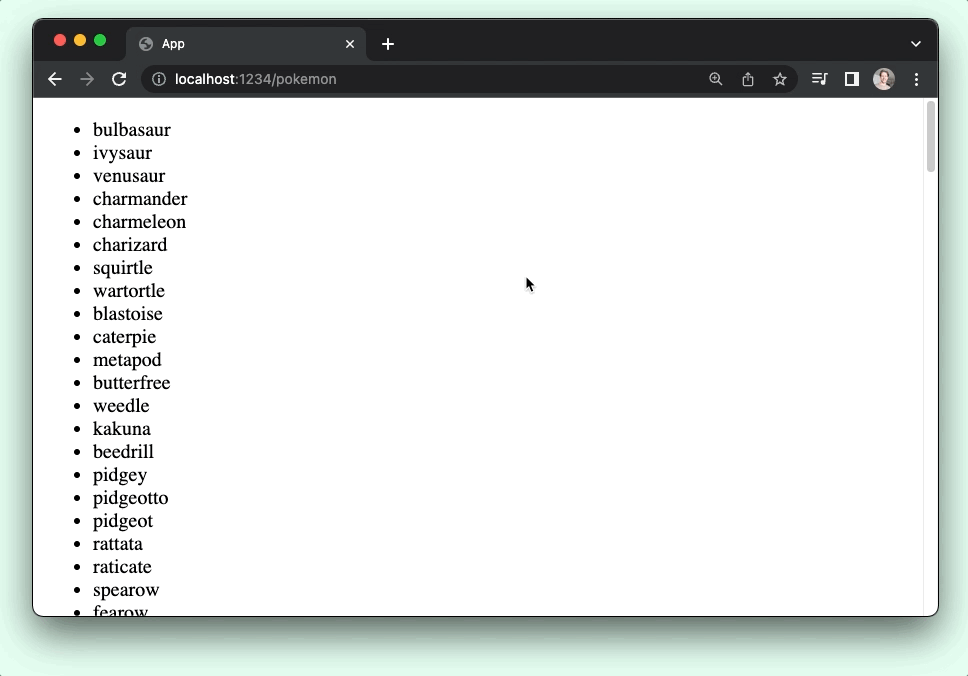

# Working with a REST API

## Page.element

When it comes time to talk to an API, you'll need a page that can send HTTP requests. For example, if you want to use the [PokeAPI](https://pokeapi.co/) to fetch 'em all, you can do that by creating a new page.



```sh
npx elm-land add page:element /pokemon
```

<code-group>
<code-block title="src/Pages/Pokemon.elm">

```elm
module Pages.Pokemon exposing (Model, Msg, page)

import Html exposing (Html)
import Page exposing (Page)
import View exposing (View)


-- PAGE


page : Page Model Msg
page =
    Page.element
        { init = init
        , update = update
        , subscriptions = subscriptions
        , view = view
        }


-- INIT


type alias Model =
    {}


init : ( Model, Cmd Msg )
init =
    ( {}
    , Cmd.none
    )


-- UPDATE


type Msg
    = ExampleMsgReplaceMe


update : Msg -> Model -> ( Model, Cmd Msg )
update msg model =
    case msg of
        ExampleMsgReplaceMe ->
            ( model, Cmd.none )


-- SUBSCRIPTIONS


subscriptions : Model -> Sub Msg
subscriptions model =
    Sub.none


-- VIEW


view : Model -> View Msg
view model =
    { title = "Pages.Pokemon"
    , body = [ Html.text "/pokemon" ]
    }
```

</code-block>
</code-group>

## JSON & HTTP

Elm comes with two packages for working with HTTP requests that return JSON data, like the PokeAPI does.

You can use the Elm CLI tool to install those to your project:

```sh
npx elm install elm/http
```

```sh
npx elm install elm/json
```

Once those two packages are installed, they will be added to your `elm.json` file, and you should be able to import the `Http` and `Json.Decode` modules in your projects.

Let's update our `src/Pages/Pokemon.elm` file to get first 150 pokemon from PokeAPI.

To do that, we're going to add 3 new files:


```hs
-- ...
src/
 |- Api.elm          -- Top-level module for REST API stuff
 |- Api/
     |- Pokemon.elm  -- Fetches data from /api/v2/pokemon
 |- Pages/
     |- Pokemon.elm  -- Our Pokemon page
     -- ...
 -- ...
```


<code-group>

<code-block title="src/Api.elm">

```elm
module Api exposing (Data(..), get)

import Http
import Json.Decode


type Data value
    = Loading
    | Success value
    | Failure Http.Error


fromResult : Result Http.Error value -> Data value
fromResult result =
    case result of
        Ok value ->
            Success value

        Err httpError ->
            Failure httpError


get :
    { url : String
    , onResponse : Data value -> msg
    , decoder : Json.Decode.Decoder value
    }
    -> Cmd msg
get options =
    Http.get
        { url = options.url
        , expect =
            Http.expectJson
                (\httpResult ->
                    options.onResponse
                        (fromResult httpResult)
                )
                options.decoder
        }

```
</code-block>

<code-block title="src/Api/Pokemon.elm">

```elm
module Api.Pokemon exposing (Pokemon, getAll)

import Api
import Http
import Json.Decode


type alias Pokemon =
    { name : String
    }


getAll : { onResponse : Api.Data (List Pokemon) -> msg } -> Cmd msg
getAll options =
    Api.get
        { url = "https://pokeapi.co/api/v2/pokemon?limit=150"
        , onResponse = options.onResponse
        , decoder = Json.Decode.field "results" pokemonListDecoder
        }


pokemonListDecoder : Json.Decode.Decoder (List Pokemon)
pokemonListDecoder =
    Json.Decode.list pokemonDecoder


pokemonDecoder : Json.Decode.Decoder Pokemon
pokemonDecoder =
    Json.Decode.map Pokemon
        (Json.Decode.field "name" Json.Decode.string)

```
</code-block>

<code-block title="src/Pages/Pokemon.elm">

```elm{3-4,29,35-40,48,54-57,77-87,91-93}
module Pages.Pokemon exposing (Model, Msg, page)

import Api
import Api.Pokemon exposing (Pokemon)
import Page exposing (Page)
import Html exposing (Html)
import View exposing (View)


-- PAGE


page : Page Model Msg
page =
    Page.element
        { init = init
        , update = update
        , subscriptions = subscriptions
        , view = view
        }


-- INIT


type alias Model =
    { pokemonData : Api.Data (List Pokemon)
    }


init : ( Model, Cmd Msg )
init =
    ( { pokemonData = Api.Loading
      }
    , Api.Pokemon.getAll
        { onResponse = PokeApiResponded
        }
    )


-- UPDATE


type Msg
    = PokeApiResponded (Api.Data (List Pokemon))


update : Msg -> Model -> ( Model, Cmd Msg )
update msg model =
    case msg of
        PokeApiResponded data ->
            ( { model | pokemonData = data }
            , Cmd.none
            )


-- SUBSCRIPTIONS


subscriptions : Model -> Sub Msg
subscriptions model =
    Sub.none


-- VIEW


view : Model -> View Msg
view model =
    { title = "Pages.Pokemon"
    , body =
        [ case model.pokemonData of
            Api.Loading ->
                Html.text "Loading..."

            Api.Success pokemon ->
                Html.ul []
                    (List.map viewPokemonName pokemon)

            Api.Failure httpError ->
                Html.text "Something went wrong..."
        ]
    }


viewPokemonName : Pokemon -> Html Msg
viewPokemonName pokemon =
    Html.li [] [ Html.text pokemon.name ]

```

</code-block>
</code-group>