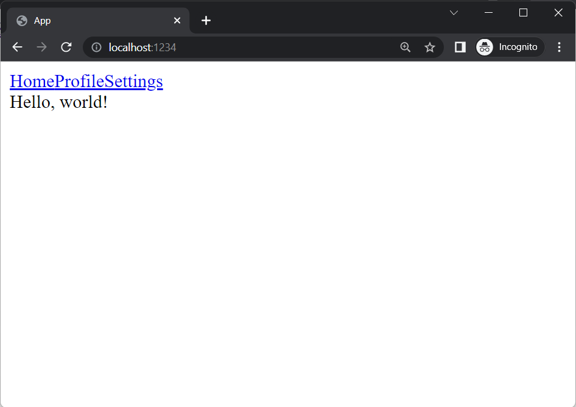
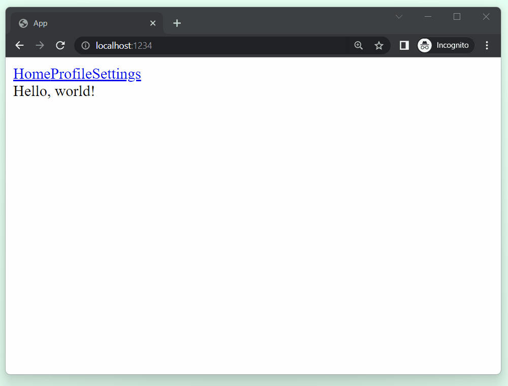

# Layouts

## Reusing UI across pages

It's common in a web application to have common UI shared across pages. For example, on Twitter, there is a sidebar layout that persists as you go from your feed to your profile page.

Let's add a sidebar layout to our Elm Land application, so we can easily navigate from one page to another.

```bash
npx elm-land add layout Sidebar
```

<code-group>
<code-block title="Terminal output">

```txt
🌈 New layout added!

You can edit your layout here:
👉 ./src/Layouts/Sidebar.elm
```

</code-block>
</code-group>

This will create a new file at `src/Layouts/Sidebar.elm` with the following contents:


<code-group>
<code-block title="src/Layouts/Sidebar.elm">

```elm
module Layouts.Sidebar exposing (layout)

import Html exposing (Html)
import Html.Attributes as Attr
import View exposing (View)


layout : { page : View msg } -> View msg
layout { page } =
    { title = page.title
    , body = 
        [ Html.div
            [ Attr.class "layout" ]
            page.body
        ]
    }
```

</code-block>
</code-group>


### Adding a sidebar

Let's add in a bit of HTML to our new layout, so that we render a sidebar next to the current page.


<code-group>
<code-block title="src/Layouts/Sidebar.elm">

```elm{14-15,21-27}
module Layouts.Sidebar exposing (layout)

import Html exposing (Html)
import Html.Attributes as Attr
import View exposing (View)


layout : { page : View msg } -> View msg
layout { page } =
    { title = page.title
    , body = 
        [ Html.div
            [ Attr.class "layout" ]
            [ viewSidebar
            , Html.div [ Attr.class "page" ] page.body
            ]
        ]
    }


viewSidebar : Html msg
viewSidebar =
    Html.aside [ Attr.class "sidebar" ]
        [ Html.a [ Attr.href "/" ] [ Html.text "Home" ]
        , Html.a [ Attr.href "/profile/me" ] [ Html.text "Profile" ]
        , Html.a [ Attr.href "/settings/account" ] [ Html.text "Settings" ]
        ]
```

</code-block>
</code-group>

## Using layouts in pages

If we want to use our Sidebar layout on the homepage, we'll need to make some changes to `src/Home_.elm`.

We tell Elm Land which layout we'd like to use by defining a `layout` function within our page module:


<code-group>
<code-block title="src/Pages/Home_.elm">

```elm{4,8-10}
module Pages.Home_ exposing (page)

import Html exposing (Html)
import Layout exposing (Layout)
import View exposing (View)


layout : Layout
layout =
    Layout.Sidebar


page : View msg
page =
    { title = "Homepage"
    , body = [ Html.text "Hello, world!" ]
    }
```

</code-block>
</code-group>

Now, when we navigate to our app at [http://localhost:1234](http://localhost:1234), we should see the sidebar links being rendered above the homepage content:



### Adding the layout to other pages

Let's do the same thing on our `Profile` and `Settings` pages, so that as we use the links in our app, the navbar is always available:


<code-group>
<code-block title="src/Pages/Profile/Username_.elm">

```elm{4,8-10}
module Pages.Profile.Username_ exposing (page)

import Html exposing (Html)
import Layout exposing (Layout)
import View exposing (View)


layout : Layout
layout =
    Layout.Sidebar


page : View msg
page =
    { title = "Page.Profile.Username_"
    , body = [ Html.text ("/profile/" ++ params.username) ]
    }
```

</code-block>
<code-block title="src/Pages/Settings/Account.elm">

```elm{4,8-10}
module Pages.Settings.Account exposing (page)

import Html exposing (Html)
import Layout exposing (Layout)
import View exposing (View)


layout : Layout
layout =
    Layout.Sidebar


page : View msg
page =
    { title = "Page.Settings.Account"
    , body = [ Html.text "/settings/account" ]
    }
```

</code-block>
</code-group>




You might have noticed something off about our sidebar layout... it's not on the side! In the next section, we'll learn how to use CSS with Elm Land to style our application.

See you there!
