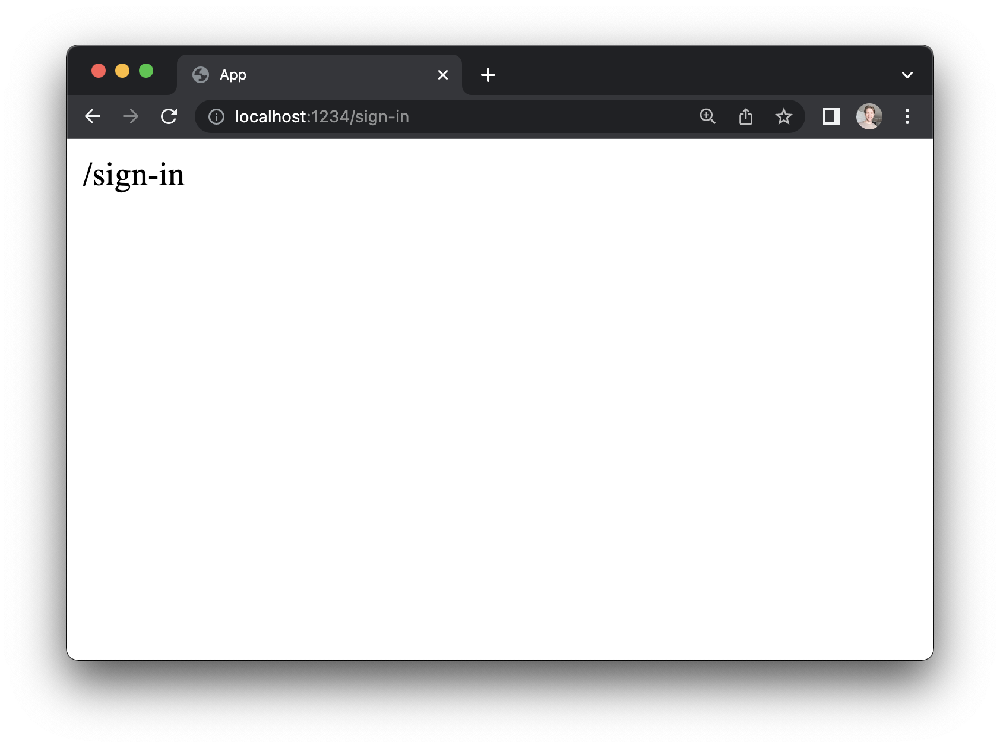
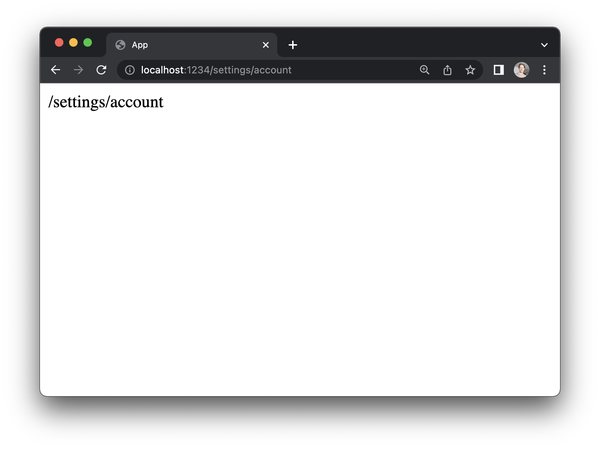
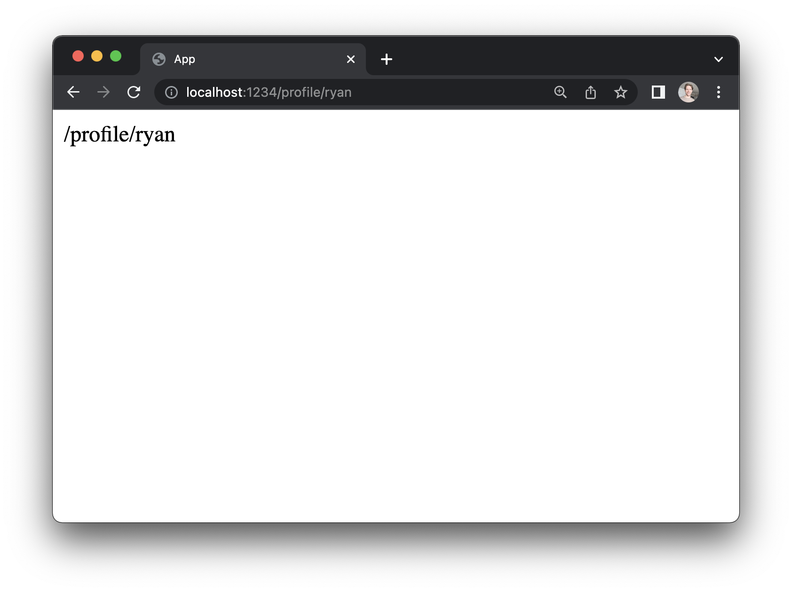

# Adding more pages

## One app, many pages

When we created a new project with the `elm-land init` command, a homepage was automatically created for us. For most web applications, you will need to break your project into __multiple pages__. 

For example, if we were making a _Twitter_ clone, we might want something like this:

- __Homepage__ - shows a feed of the latest posts
- __Sign in__ - allow users to sign in with email/password
- __Settings__ - allows a user to change their account settings
- __Profile__ - View the profile of a specific user

With _Elm Land_, each one of these will map to an Elm file in our `src/Pages` folder:

Page | URLs | Elm file
:-- | :-- | :--
Homepage | `/` | `src/Pages/Home_.elm`
Sign in | `/sign-in` | `src/Pages/SignIn.elm`
Settings | `/settings/account` | `src/Pages/Settings/Account.elm`
Profile | `/profile/:username` | `src/Pages/Profile/Username_.elm`


## Adding a new page

The easiest way to add pages to your application is with the Elm Land CLI! 

Let's start by adding a new "Sign In" page at `/sign-in`:

```sh
npx elm-land add page:static /sign-in
```

<code-group>
<code-block title="Terminal output">

```txt
🌈 New page added at /sign-in

You can edit your new page here:
👉 ./src/Pages/SignIn.elm
```

</code-block>
</code-group>

Each time you run this command, a new file will be created in the `src/Pages` folder that looks something like this:

<code-group>
<code-block title="src/Pages/SignIn.elm">

```elm
module Pages.SignIn exposing (page)

import Html
import View exposing (View)


page : View msg
page =
    { title = "Pages.SignIn"
    , body = [ Html.text "/sign-in" ]
    }
```

</code-block>
</code-group>

If you have a dev server running (with the `elm-land server` command), you can see the new sign in page at [http://localhost:1234/sign-in](http://localhost:1234/sign-in):



## Nested routes

For some pages in our app, we might want a URL like `/settings/account` or `/settings/notifications`. In _Elm Land_, we refer to these as __nested routes__. A "nested route" is just a route with more than one slash in the URL:

```sh
npx elm-land add page:static /settings/account
```

<code-group>
<code-block title="src/Pages/Settings/Account.elm">

```elm
module Pages.Settings.Account exposing (page)

import Html
import View exposing (View)


page : View msg
page =
    { title = "Pages.Settings.Account"
    , body = [ Html.text "/settings/account" ]
    }
```

</code-block>
</code-group>



## Dynamic routes

For things like our _Profile_ page, we won't know all the usernames up-front. We'll need a way to have a single page that works for _any_ username that might exist.

If we need a page to handle URLs like `/profile/ryan`, `/profile/duncan`, or `/profile/alexa`, we can make a __dynamic route__. 

A "dynamic route" passes in URL parameters (like `username`) to your page, so it can handle many different values.

```sh
npx elm-land add page:static /profile/:username
```




<code-group>
<code-block title="src/Pages/Profile/Username_.elm">

```elm
module Pages.Profile.Username_ exposing (page)

import Html
import View exposing (View)


page : { username : String } ->  View msg
page params =
    { title = "Pages.Profile.Username_"
    , body = [ Html.text ("/profile/" ++ params.username) ]
    }
```

</code-block>
</code-group>

### File names matter!

The names of our page files affect which URL renders our page, and the names of any dynamic URL parameters.

Because our profile page is at `Profile/Username_.elm`, the value for our URL parameter is `params.username`. If we renamed this file to `Profile/Id_.elm`, it would automatically update the parameter name to `params.id`.


::: tip Underscores in file names
For some pages, you may have noticed there is a __trailing underscore__ in the filename. Here are the two reasons your files will have an underscore in them:
1. To distinguish `/` from `/home` 
     - Our homepage is `Home_.elm` rather than `Home.elm`
2. To distinguish a __static__ page from a __dynamic__ one:
     - `Profile/Username.elm` only handles `/profile/username`
     - `Profile/Username_.elm` handles `/profile/ryan`, `profile/duncan`, and more!

:::


### Our project so far

After adding in all these pages, our project should look something like this:

```hs
elm.json
elm-land.json
src/
 |- Pages/
     |- Home_.elm
     |- SignIn.elm
     |- Settings/
        |- Account.elm
     |- Profile/
        |- Username_.elm
```

Right now, to navigate from one page to another, we've been manually changing the URL in the browser. In a real app, we'd need a way for our users to navigate around via our app's UI. 

The next thing we'll do is add a sidebar layout, which allow us to render one sidebar across different pages in our app.