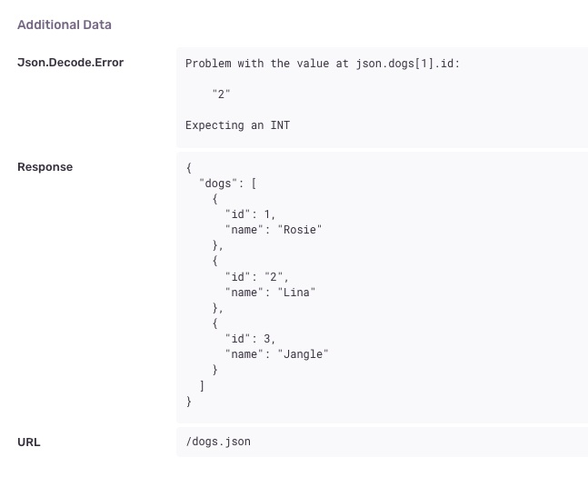

# 11-error-reporting

An example of how to report all HTTP errors to an error reporting service, like Sentry!

## Trying it out

### 1. Create a free Sentry project

This example uses [Sentry.io](https://sentry.io) to report errors. If you'd like to see this example working, you'll need to create a free Sentry account.

( I signed up using my existing GitHub account! )


### 2. Find your project's `dsn` URL
After signing up, create a new "JavaScript" project. The create screen will show you your personal Sentry "dsn" URL, which should look something like this:

```js
// A shortened version of what your URL will look like:
{
  dsn: "https://abc@xyz.ingest.sentry.io/123456"
  // ...
}
```

### 3. Use that URL when running `npm start`

You'll need to provide that URL as `SENTRY_DSN` when running the `npm start` command:

```
SENTRY_DSN="https://abc@xyz.ingest.sentry.io/123456" npm start
```

That command will install the [@sentry/browser](https://www.npmjs.com/package/@sentry/browser) and [@sentry/tracing](https://www.npmjs.com/package/@sentry/tracing) packages before starting up the Elm Land server!

### 4. Open your web browser

When you visit the homepage in this example, an HTTP API call will fail and that error should show up in your Sentry dashboard (under the `development` environment tag)

Click into the error message to see the "Additional data" section, including the URL, JSON Response, and Json.Decode.Error message sent from Elm!

