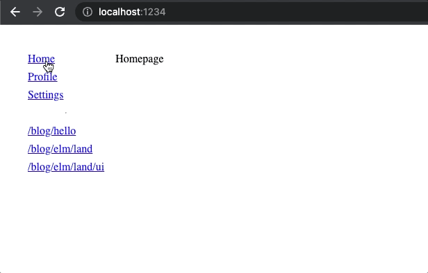
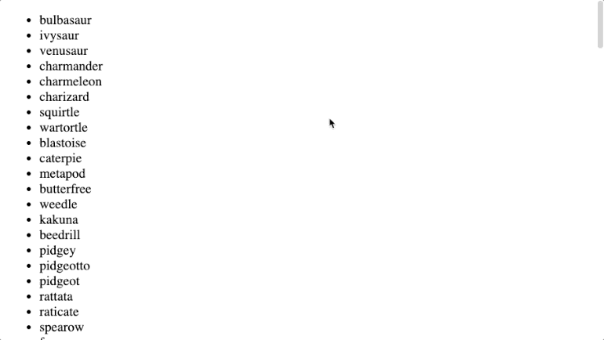

# @elm-land/examples
> Complete examples of [Elm Land](https://elm.land) apps for folks to explore.

## 1. Hello world!

A minimal introduction to the _Elm Land_ framework.

[Example code](./01-hello-world/) • [The guide](https://elm.land/guide/)

## 2. Pages and routes

Learn how to add pages, a sidebar component, and CSS to your project.

[Example code](./02-pages-and-routes/) • [The guide](https://elm.land/guide/pages-and-routes)

## 3. User input

Learn how to work with user input and "The Elm Architecture"

[Example code](./03-user-input/) • [The guide](https://elm.land/guide/user-input)

## 4. REST APIs

Learn how to get JSON responses from a HTTP REST API

[Example code](./04-rest-apis/) • [The guide](https://elm.land/guide/rest-apis)

## 5. User authentication

Learn how to build a sign-in page, store JWTs, and have pages automatically redirect.

[Example code](./05-user-auth/) • (Guide in progress!)

## 6. Query parameters

Learn how to work with URL parameters to build an interactive table with filtering and sorting.

[Example code](./08-query-parameters/) • (Guide coming soon!)

