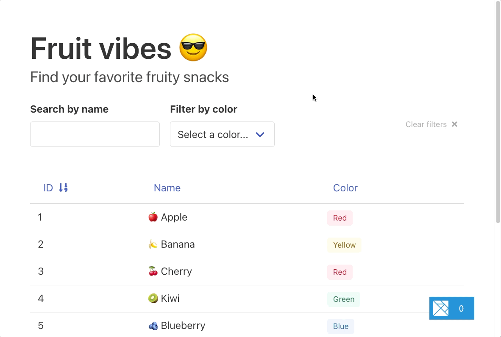
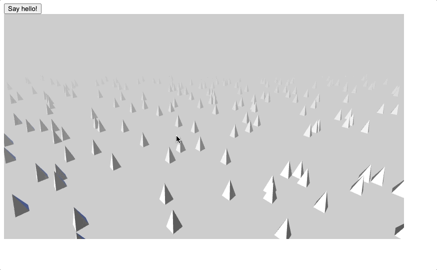

# @elm-land/examples
> Complete examples of [Elm Land](https://elm.land) apps for folks to explore.

### Table of contents

1. [Hello, world!](#1-hello-world)
1. [Pages and routes](#2-pages-and-routes)
1. [User input](#3-user-input)
1. [REST APIs](#4-rest-apis)
1. [User authentication](#5-user-authentication)
1. [Query parameters](#6-query-parameters)
1. [Working with JS](#7-working-with-js)

#### Even more examples

- [TypeScript interop](./10-typescript-interop/)
- [Production error reporting with Sentry](./11-error-reporting/)
- [Elm UI](./12-elm-ui/)
- [Elm CSS](./13-elm-css/)
- [SCSS and assets](./14-scss-and-assets/)
- [Custom 404 pages](./15-custom-404-pages/)
- [Hash-bashed routing](./16-hash-based-routing/)
- [Shared subscriptions](./17-shared-subscriptions/)

## 1. Hello world!

A minimal introduction to the _Elm Land_ framework.

[Example code](./01-hello-world/) • [The guide](https://elm.land/guide/)

## 2. Pages and routes

Learn how to add pages, a sidebar component, and CSS to your project.

[Example code](./02-pages-and-routes/) • [The guide](https://elm.land/guide/pages-and-routes)

## 3. User input

Learn how to work with user input and "The Elm Architecture"

[Example code](./03-user-input/) • [The guide](https://elm.land/guide/user-input)

## 4. REST APIs

Learn how to get JSON responses from a HTTP REST API

[Example code](./04-rest-apis/) • [The guide](https://elm.land/guide/rest-apis)

## 5. User authentication

Learn how to build a sign-in page, store JWTs, and have pages automatically redirect.

[Example code](./05-user-auth/) • [The guide](https://elm.land/guide/user-auth)

## 6. Query parameters

Learn how to work with URL parameters to build an interactive table with filtering and sorting.

[Example code](./06-query-parameters/) • (Guide in-progress)

## 7. Working with JS

Learn how to work with existing NPM packages, run JavaScript from Elm, and 

[Example code](./07-working-with-js/) • [The guide](https://elm.land/guide/working-with-js)

